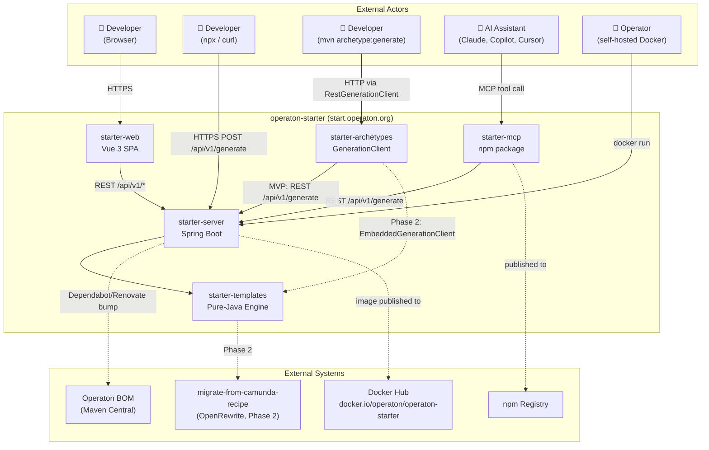

# Arc42 Section 3: System Scope and Context

## System Context

operaton-starter (`start.operaton.org`) accepts project generation requests from multiple actor types and produces downloadable project archives. It integrates with external systems for dependency management and publishing, but has zero external dependencies at request-handling time.

## External Interface Summary

| External Interface | Direction | Protocol | Notes |
|-------------------|-----------|----------|-------|
| Browser → `starter-web` | Inbound | HTTPS | SPA served as static assets from `starter-server` |
| CLI / curl → `starter-server` | Inbound | HTTPS REST | `POST /api/v1/generate`, `GET /api/v1/metadata` |
| AI assistant → `starter-mcp` | Inbound | MCP (stdio/SSE) | `generate_project` tool wraps REST API |
| `mvn archetype:generate` → `starter-archetypes` | Inbound | HTTP REST (via `RestGenerationClient`) | MVP: delegates to `starter-server` |
| `starter-server` → Operaton BOM | Outbound (CI only) | Maven dependency resolution | Not at runtime; Dependabot/Renovate PRs only |
| CI → Docker Hub | Outbound (CI only) | Docker push | On tagged releases via `release.yml` |
| CI → npm Registry | Outbound (CI only) | npm publish | `operaton-starter-mcp` and `operaton-starter` CLI on tag |

## Business Context

### Channel Matrix

All channels invoke the same generation engine via the same REST API. Functionally identical output is enforced by the CI test matrix.

| Channel | Entry Point | Primary Persona | Notes |
|---------|-------------|-----------------|-------|
| Web UI | `https://start.operaton.org` | Marcus (Practitioner), Thomas (Explorer) | Gallery + form; live preview; IDE deep-links |
| REST API / curl | `POST /api/v1/generate` | Priya (API Consumer) | Documented in Scalar at `/api/v1/docs` |
| CLI | `npx operaton-starter` | Practitioner (scriptable) | Pipe mode to stdout; env var URL override |
| MCP | `operaton-starter-mcp` npm package | AI assistant users | `generate_project` tool; env var URL override |
| Maven Archetype | `mvn archetype:generate` | Marcus (IDE workflow) | Phase 2: `EmbeddedGenerationClient` for offline use |
| Self-hosted | Docker image | Klaus (Admin), Priya (Enterprise) | Zero external deps; env-var config only |

## Cross-Cutting Concerns at Context Level

1. **Metadata contract** — `GET /api/v1/metadata` is the projection between engine and all channels. No channel hardcodes option lists.
2. **Stateless design** — No session state, no database. Any instance handles any request.
3. **Spec-first discipline** — `openapi.yaml` at project root is the source of truth for all channel clients.
4. **Version currency** — Operaton BOM version baked at build time for public instance; overridable via `OPERATON_VERSION` env var for self-hosted instances only.
