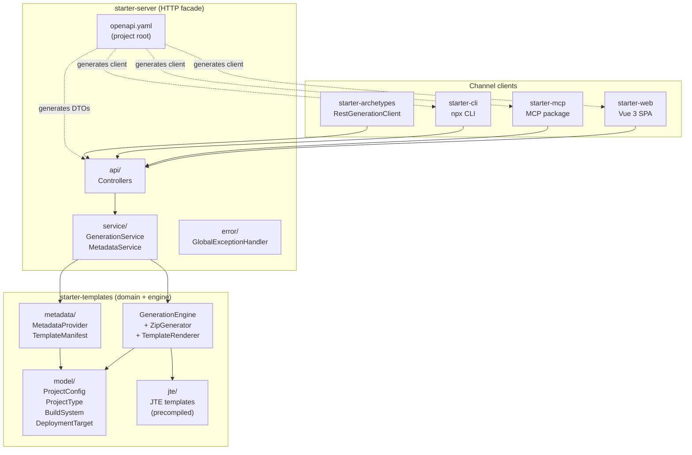

# Arc42 Section 5: Building Block View

## Level 1: Monorepo Overview



## Module Responsibilities

### `starter-templates` — Domain & Engine

**Responsibility:** Owns the shared domain model and the generation engine. The only module that can produce a project archive ZIP.

**Public API:**
- `GenerationEngine.generate(ProjectConfig) → byte[]` — single entry point for generation
- `MetadataProvider` — provides project type descriptors and template manifests

**Key rule:** Zero Spring dependencies. ArchUnit test (`ZeroSpringDependencyTest`) enforces this at build time.

**Packages:**
- `org.operaton.dev.starter.templates.model` — `ProjectConfig`, `ProjectType`, `BuildSystem`, `DeploymentTarget`
- `org.operaton.dev.starter.templates.engine` — `GenerationEngine`, `ZipGenerator`, `TemplateRenderer`
- `org.operaton.dev.starter.templates.metadata` — `MetadataProvider`, `ProjectTypeDescriptor`, `TemplateManifest`

### `starter-server` — REST API

**Responsibility:** Thin HTTP façade over the generation engine. Owns rate limiting, CORS, error translation, and API documentation.

**Packages:**
- `org.operaton.dev.starter.server.api` — controllers, DTOs (generated from `openapi.yaml`)
- `org.operaton.dev.starter.server.api.error` — `GlobalExceptionHandler` (@ControllerAdvice → Problem Details)
- `org.operaton.dev.starter.server.config` — `RateLimitConfig` (Bucket4j), `WebConfig` (CORS), `StarterProperties`
- `org.operaton.dev.starter.server.service` — `GenerationService` (maps DTO → `ProjectConfig`), `MetadataService`

**Key rule:** DTOs in `target/generated-sources/openapi/dto/` are generated from `openapi.yaml`. Never hand-edited.

### `starter-archetypes` — GenerationClient Interface

**Responsibility:** Defines the `GenerationClient` strategy interface enabling `mvn archetype:generate` integration.

**Packages:**
- `org.operaton.dev.starter.archetypes` — `GenerationClient` interface, `RestGenerationClient` (MVP)
- `org.operaton.dev.starter.archetypes.config` — `ClientConfig`

**Phase 2:** `EmbeddedGenerationClient` calls `starter-templates` directly (no network).

### `starter-web` — Vue 3 SPA

**Responsibility:** Browser-based user interface. Serves both Practitioner (form-first) and Explorer (gallery-first) workflows. Client-side file tree preview with no server round-trips.

**Layout:**
```
src/
├── assets/          ← design token CSS (extracted from operaton.org)
├── components/
│   ├── gallery/     ← ProjectGallery.vue, ProjectCard.vue, TypeBadge.vue
│   ├── form/        ← ConfigurationForm.vue, BuildSystemSelector.vue, IdentityFields.vue, etc.
│   ├── preview/     ← FileTreePreview.vue, FileTreeNode.vue
│   └── shared/      ← ErrorBanner.vue, LoadingSpinner.vue
├── composables/     ← useMetadata.ts, useGenerate.ts, useShareableLink.ts
├── generated/       ← OpenAPI-generated API client (do not edit)
├── router/          ← index.ts (gallery / configure routes)
├── types/           ← api.ts
└── views/           ← GalleryView.vue, ConfigureView.vue
```

**Key rule:** `src/generated/` is owned by the OpenAPI generator. No hand-edits.

### `starter-mcp` — MCP npm Package

**Responsibility:** Exposes the generation API as an MCP tool callable by AI assistants.

**Package name:** `operaton-starter-mcp`

**Layout:**
```
src/
├── generated/       ← OpenAPI-generated client (do not edit)
├── tools/           ← generateProject.ts (MCP tool definition)
└── index.ts         ← package entry point
```

### `starter-cli` — CLI npm Package

**Responsibility:** `npx operaton-starter` entry point. Dual-mode: pipe to stdout (scriptable) / TTY interactive (Phase 2).

**Package name:** `operaton-starter`

**Layout:**
```
src/
├── generated/       ← OpenAPI-generated client (do not edit)
├── commands/        ← generate.ts
└── index.ts         ← dual-mode entry (pipe vs. TTY)
```

## Complete Project Tree

```
operaton-starter/
├── pom.xml                          ← Maven parent POM (6 modules)
├── openapi.yaml                     ← API contract source of truth
├── Dockerfile                       ← starter-server image (eclipse-temurin:25-jre-alpine)
├── docker-compose.dev.yml           ← local development environment
├── renovate.json
├── .editorconfig
├── .gitignore
├── README.md
│
├── .github/
│   └── workflows/
│       ├── ci.yml                   ← build-java + test-matrix + contract-check + lint-web
│       └── release.yml              ← docker-publish + npm-publish (on tag)
│
├── docs/
│   └── arc42/                       ← this directory
│
├── starter-templates/
│   ├── pom.xml
│   └── src/
│       ├── main/
│       │   ├── java/org/operaton/dev/starter/templates/
│       │   │   ├── GenerationEngine.java
│       │   │   ├── model/
│       │   │   │   ├── ProjectConfig.java
│       │   │   │   ├── ProjectType.java
│       │   │   │   ├── BuildSystem.java
│       │   │   │   └── DeploymentTarget.java
│       │   │   ├── engine/
│       │   │   │   ├── ZipGenerator.java
│       │   │   │   └── TemplateRenderer.java
│       │   │   └── metadata/
│       │   │       ├── MetadataProvider.java
│       │   │       ├── ProjectTypeDescriptor.java
│       │   │       └── TemplateManifest.java
│       │   └── jte/
│       │       ├── process-application/
│       │       │   ├── maven/
│       │       │   ├── gradle-groovy/
│       │       │   └── gradle-kotlin/
│       │       ├── process-archive/
│       │       │   ├── maven/
│       │       │   ├── gradle-groovy/
│       │       │   └── gradle-kotlin/
│       │       └── common/
│       │           ├── README.jte
│       │           ├── github-actions.jte
│       │           ├── docker-compose.jte
│       │           ├── renovate.jte
│       │           ├── dependabot.jte
│       │           └── skeleton.bpmn.jte
│       └── test/java/org/operaton/dev/starter/templates/
│           ├── GenerationEngineTest.java   ← @ParameterizedTest all 6 combinations
│           ├── ZeroSpringDependencyTest.java
│           └── fixtures/TestProjectConfigs.java
│
├── starter-server/
│   ├── pom.xml
│   └── src/
│       ├── main/
│       │   ├── java/org/operaton/dev/starter/server/
│       │   │   ├── StarterServerApplication.java
│       │   │   ├── api/
│       │   │   │   ├── GenerateController.java
│       │   │   │   ├── MetadataController.java
│       │   │   │   ├── DocsController.java
│       │   │   │   ├── dto/                    ← generated (do not edit)
│       │   │   │   └── error/GlobalExceptionHandler.java
│       │   │   ├── config/
│       │   │   │   ├── RateLimitConfig.java
│       │   │   │   ├── StarterProperties.java
│       │   │   │   └── WebConfig.java
│       │   │   └── service/
│       │   │       ├── GenerationService.java
│       │   │       └── MetadataService.java
│       │   └── resources/
│       │       ├── application.properties
│       │       └── static/
│       │           ├── api-docs.html
│       │           └── (starter-web dist/ copied here)
│       └── test/java/org/operaton/dev/starter/server/
│           ├── api/GenerateControllerTest.java
│           ├── api/MetadataControllerTest.java
│           └── integration/GenerationIntegrationTest.java
│
├── starter-archetypes/
│   ├── pom.xml
│   └── src/main/java/org/operaton/dev/starter/archetypes/
│       ├── GenerationClient.java
│       ├── RestGenerationClient.java
│       └── config/ClientConfig.java
│
├── starter-web/
│   ├── pom.xml
│   ├── package.json
│   ├── vite.config.ts
│   ├── tailwind.config.js
│   └── src/ (see layout above)
│
├── starter-mcp/
│   ├── pom.xml
│   ├── package.json
│   └── src/ (see layout above)
│
└── starter-cli/
    ├── pom.xml
    ├── package.json
    └── src/ (see layout above)
```

## Requirements to Structure Mapping

| FR Category | Primary Module |
|-------------|----------------|
| Generation Engine (FR1–8, FR42) | `starter-templates/` — `GenerationEngine`, JTE templates |
| Project Configuration (FR9–16) | `starter-templates/model/` — `ProjectConfig`, enums |
| Web UI (FR17–23, FR40–41, FR43) | `starter-web/src/` — views, components, composables |
| REST API (FR24–27) | `starter-server/src/main/`, `openapi.yaml` |
| CLI (FR28–30) | `starter-cli/src/` |
| MCP Integration (FR31–32) | `starter-mcp/src/tools/generateProject.ts` |
| Generated Project Quality (FR33–36, FR44) | `starter-templates/jte/` — all JTE template files |
| Self-Hosting & Operations (FR37–39) | `Dockerfile`, `application.properties`, `WebConfig.java` |
