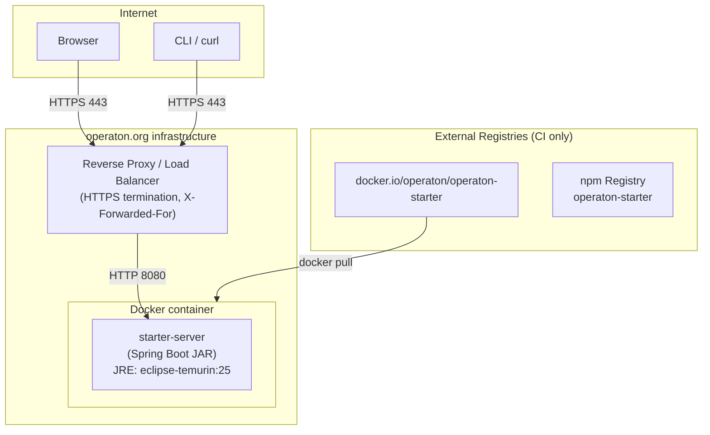
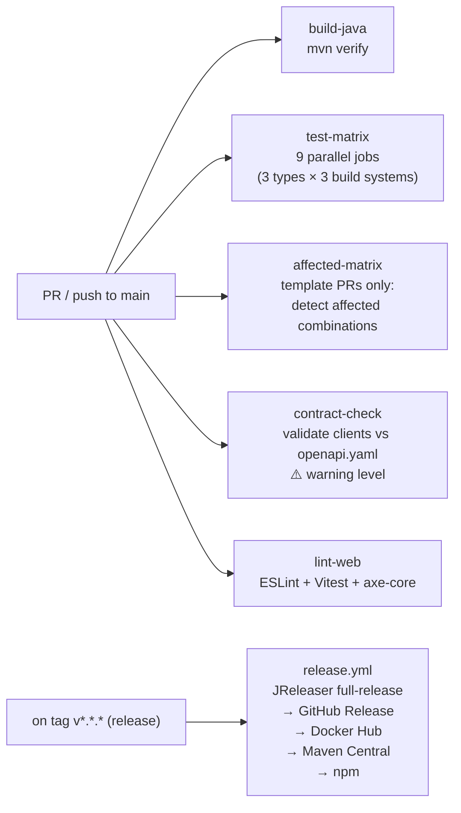

# Arc42 Section 7: Deployment View

## Production Deployment: start.operaton.org



**Deployment characteristics:**
- Stateless: any number of container replicas; no sticky sessions
- Zero external dependencies at runtime (no DB, no Redis, no external API calls)
- Docker image published to `docker.io/operaton/operaton-starter` on every tagged release
- Reverse proxy handles HTTPS; application serves HTTP on port 8080

## Docker Image

**Base image:** `eclipse-temurin:25-jre-alpine`

**Layer structure (Spring Boot layered JAR):**
```dockerfile
FROM eclipse-temurin:25-jre-alpine AS builder
WORKDIR /app
COPY starter-server/target/*.jar app.jar
RUN java -Djarmode=layertools -jar app.jar extract

FROM eclipse-temurin:25-jre-alpine
WORKDIR /app
COPY --from=builder /app/dependencies/ ./
COPY --from=builder /app/spring-boot-loader/ ./
COPY --from=builder /app/snapshot-dependencies/ ./
COPY --from=builder /app/application/ ./
ENTRYPOINT ["java", "org.springframework.boot.loader.launch.JarLauncher"]
```

Layer extraction maximizes Docker build cache efficiency — dependency layers (rarely change) are separated from application layers (change with every release).

**Network isolation test:** CI verifies the image starts and responds to `GET /actuator/health` with `--network none` (no outbound network access at runtime).

## CI/CD Pipeline



### CI Jobs Detail

**`build-java`** (`ci.yml`)
- `mvn verify` — compiles, runs unit tests, ArchUnit zero-Spring enforcement
- Includes `ZeroSpringDependencyTest` for `starter-templates`
- Hard block on failure

**`test-matrix`** (`ci.yml`)
- 9 parallel shell jobs: 3 project types × 3 build systems (`PROCESS_APPLICATION`, `PROCESS_ARCHIVE`, `DMN_PROJECT` × `MAVEN`, `GRADLE_GROOVY`, `GRADLE_KOTLIN`)
- Each job: call `POST /api/v1/generate` → extract ZIP → `cd` into project → run build command
- Smoke test for `PROCESS_APPLICATION` and `DMN_PROJECT`: start app → wait for `GET /actuator/health` to return 200 within 60s
- Pinned Java version (matches generated project Java floor)
- Hard block on failure

**`affected-matrix`** (`affected-matrix.yml`, template PRs only)
- Triggers only on PRs that touch `starter-templates/src/main/jte/**`
- Runs `affected-combinations.sh` to map changed template paths to affected project-type × build-system combinations
- Validates only the affected combinations (not all 9) — keeps PR feedback fast when changing a single template

**`contract-check`** (`ci.yml`)
- Regenerates OpenAPI clients → diffs against committed versions
- Warning-level PR status (not merge block) in Phase 1
- Promoted to hard block in Phase 2 once spec is stable

**`lint-web`** (`ci.yml`)
- ESLint + Prettier check
- Vitest unit tests
- axe-core accessibility audit (WCAG 2.1 AA, hard block)
- Covers `starter-web`, `starter-cli`

**`release.yml`** (on tag `v*.*.*`)
- JReleaser `full-release`: creates GitHub Release with conventional-commits changelog, pushes Docker image to Docker Hub, publishes to Maven Central (with GPG-signed artifacts), publishes npm packages
- Pre-steps: `mvn verify -Prelease` (activates source/javadoc/GPG/Central plugin), Docker image build, npm pack
- Replaces former separate `docker-publish` and `npm-publish` jobs

## Self-Hosted Deployment

Klaus persona deployment pattern:

```bash
docker run -d \
  -p 8080:8080 \
  -e STARTER_DEFAULTS_GROUP_ID=com.bank \
  -e STARTER_DEFAULTS_MAVEN_REGISTRY=https://nexus.bank.internal/repository/maven-public \
  -e STARTER_DEFAULTS_OPERATON_VERSION=1.0.0 \
  docker.io/operaton/operaton-starter:latest
```

**Environment variables:**

| Variable | Description |
|----------|-------------|
| `STARTER_DEFAULTS_GROUP_ID` | Pre-fills Group ID field in web UI and metadata defaults |
| `STARTER_DEFAULTS_MAVEN_REGISTRY` | Maven repository URL injected into generated `pom.xml` / `build.gradle` |
| `STARTER_DEFAULTS_OPERATON_VERSION` | Pins Operaton version; public instance uses version baked at build time |
| `STARTER_CORS_ALLOWED_ORIGINS` | Comma-separated additional CORS origins |

Old-form names (`DEFAULT_GROUP_ID`, `MAVEN_REGISTRY`, `CORS_ALLOWED_ORIGINS`) are supported as fallbacks for backwards compatibility.

**Key property:** The Docker image starts with zero external network calls. All configuration is via environment variables.

## Local Development Environment

`docker-compose.dev.yml` at project root (distinct from `docker-compose.yml` generated inside project archives):

```bash
# Build the fat JAR first
./mvnw verify -pl starter-templates,starter-server -am

# Start the backend container
docker compose -f docker-compose.dev.yml up
```

Allows `starter-web` frontend developers to run the backend locally:
```bash
cd starter-web && npm run dev  # Vite dev server proxies /api/** to localhost:8080
```

See [`docs/release.md`](../release.md) for full release procedure.
