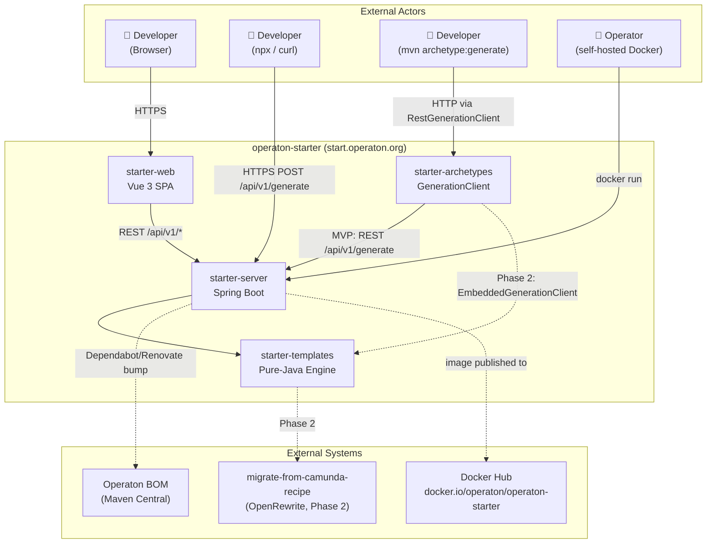
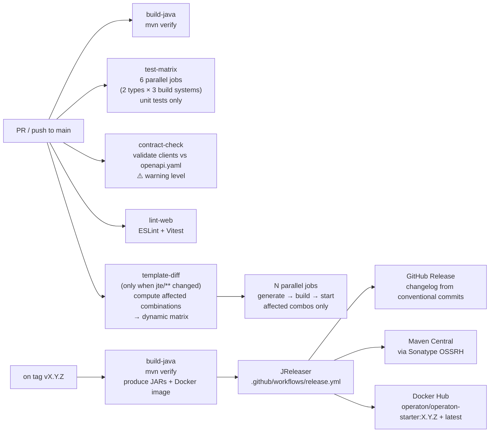
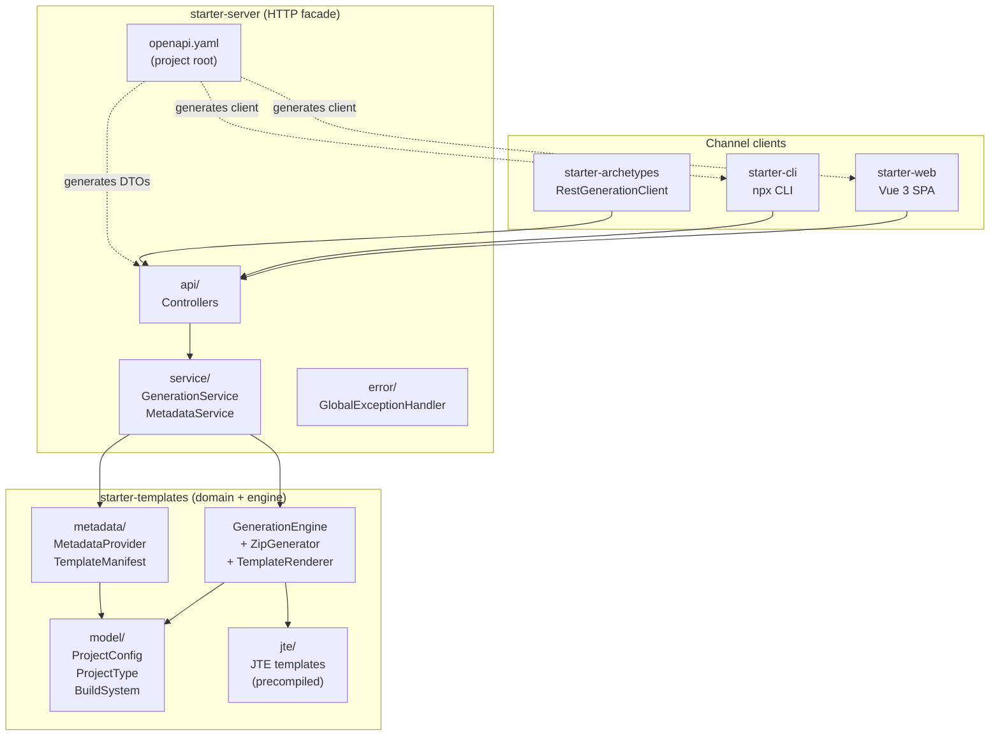

# Architecture Decision Document

_This document builds collaboratively through step-by-step discovery. Sections are appended as we work through each architectural decision together._

## Project Context Analysis
> arc42 Sections 1–3: Introduction & Goals, Constraints, System Scope

### Requirements Overview

**Functional Requirements (44 total):**

| Category | Count | Architectural Significance |
|----------|-------|---------------------------|
| Generation Engine | 9 (FR1–8, FR42) | Unified engine shared by all channels; CLI clients generated from OpenAPI spec |
| Project Configuration | 8 (FR9–16) | Identity propagation (Group/Artifact/name) is a correctness invariant across all generated files |
| Web UI | 10 (FR17–23, FR40–41, FR43) | SPA consuming metadata endpoint; client-side preview from template manifests; no per-change server round-trip |
| REST API | 4 (FR24–27) | Spec-first contract; rate limiting at IP level; metadata drives all channels |
| CLI | 3 (FR28–30) | Thin REST wrapper; dual-mode (scriptable pipe vs interactive terminal) |
| Generated Project Quality | 6 (FR33–36, FR44) | CI matrix validates all project type × build system combinations |
| Self-Hosting & Operations | 3 (FR37–39) | Docker image; env-var configuration only; health endpoint |

**Non-Functional Requirements:**

| Category | Key Constraints | Architectural Impact |
|----------|----------------|---------------------|
| Performance | POST /api/v1/generate ≤ 1s; preview ≤ 200ms (client-side) | Pure-Java in-process engine; no Maven subprocess at runtime |
| Availability | 99.9% uptime; zero external deps at startup | Stateless design; no DB dependency |
| Security | HTTPS; no user data persistence; rate limit (10 req/min/IP) | Bucket4j in-memory, best-effort; no Redis; zero PII |
| Scalability | Horizontally scalable; no sticky sessions | Share-nothing; stateless request handling |
| Accessibility | WCAG 2.1 AA; keyboard-complete flow | Web UI component design must support full keyboard navigation |
| Correctness | 100% compile + test pass; CI matrix all combinations | Engine testable without Spring context; plain Java library |
| Compatibility | Java 21+; Gradle 8+; Node.js Active LTS; latest 2 browsers | Technology floor for generated projects and runtime |
| Maintainability | Structured JSON logs; env-var-only Docker config | Operational simplicity by design |
| Visual Consistency | Match operaton.org design system (NFR20) | Extract CSS tokens from Jekyll source; SPA consumes tokens |

**Scale & Complexity:**

- Primary domain: Full-stack monorepo (Java server/templates/archetypes + TypeScript web)
- Complexity level: Medium
- Estimated architectural components: 5 monorepo modules + deployment infrastructure
- Resource profile: Solo developer

### Technical Constraints & Dependencies

- **Operaton BOM:** Generated projects always target current stable Operaton release; starter updates within 24h via automated Dependabot/Renovate PR + CI matrix pass. SLA is conditional on CI matrix passing cleanly — a breaking Operaton release pauses the SLA clock until templates are fixed.
- **Generation engine performance:** `mvn archetype:generate` (Maven subprocess) MUST NOT be used at runtime — Maven startup overhead violates NFR1 ≤1s. Maven Archetype format is the template authoring standard only; runtime engine is a pure-Java in-process library.
- **OpenAPI Generator:** CLI client code generated from the spec; spec must be frozen before client generation begins; any post-freeze change requires regenerating all clients.
- **GenerationClient strategy interface:** `starter-archetypes` defines a `GenerationClient` interface. MVP: `RestGenerationClient` (HTTP call to `/api/v1/generate`). Phase 2+: `EmbeddedGenerationClient` (calls `starter-templates` directly, no network). Enables offline `mvn archetype:generate` without engine duplication.
- **`starter-templates` zero Spring dependency:** Pure-Java library; no Spring context in generation path; enables fast CI matrix and direct embedding.
- **Rate limiting:** Bucket4j in-memory, best-effort per IP; no Redis; stateless constraint preserved.
- **Design system:** operaton.org is Jekyll-based (`github.com/operaton/operaton.org`); CSS design tokens (colors, typography, spacing) extracted before `starter-web` implementation begins.
- **SPA framework:** Vue 3 + Vite (no framework constraint from existing Jekyll site).
- **Docker registry:** `docker.io/operaton/operaton-starter`; published on every tagged release via CI.
- **Spec freeze gate:** GitHub Actions check posting to PR status panel (warning level, not merge block); promotes to hard block in Phase 2 once spec is stable.
- **Multi-language build:** Maven coordinates Java modules; npm coordinates TypeScript modules; CI orchestrates both.
- **OpenRewrite (`operaton/migrate-from-camunda-recipe`):** Phase 2 dependency; tracked explicitly; fork under Operaton org if upstream lapses.
- **Docker:** Self-hosted image starts with zero external network calls; env-var configuration only.

### Metadata Schema as First-Class Contract

`GET /api/v1/metadata` is the **projection contract** between the engine and all consumers (web UI, CLI, future channels). Schema must be defined before any channel implementation begins. Each `projectTypes` entry contains:

| Field | Purpose |
|-------|---------|
| `id` | Flag value for CLI |
| `displayName` | Rendered in gallery cards and dropdowns |
| `description` | Gallery card body copy |
| `tags` | Capability badges |
| `personaHint` | Contextual positioning (e.g. "Ideal for Camunda 7 migrators") |
| `templateManifest` | Flat list of `{ path, condition, templateId }` enabling client-side file tree preview |

Each `buildSystems` entry contains:

| Field | Purpose |
|-------|---------|
| `id` | Primary build system identifier (`maven`, `gradle`) |
| `displayName` | Rendered in the first-level build system selector |
| `dslOptions` | Array of `{ id, displayName }` sub-choices; empty array when no DSL choice applies (Maven); non-empty triggers a mandatory second-level selector in all channels |

No hardcoded option lists in any channel. Gallery content (including `personaHint`) is metadata-driven from day one. No `globalOptions.javaVersions` — generated projects target Java 21 with no picker.

### System Context Diagram

> arc42 Section 3 — full diagram in `./docs/arc42/03-context.md`



### Cross-Cutting Concerns Identified

1. **Channel consistency** — Web UI, REST API, CLI, and `mvn archetype:generate` invoke the same generation engine; functionally identical output enforced by CI matrix
2. **Spec-first discipline** — OpenAPI spec and metadata schema frozen before any channel implementation; spec freeze enforced as a GitHub Actions PR status check (warning level)
3. **Stateless design** — No session state, no database, no sticky sessions; Bucket4j in-memory rate limiting (best-effort)
4. **Identity propagation** — Group ID, Artifact ID, project name flow into BPMN process IDs, Java package names, `application.name`, build coordinates
5. **Version currency** — Always current Operaton release; automated via Dependabot/Renovate PR + CI matrix gate; ≤24h SLA conditional on CI matrix pass
6. **Client-side preview** — Metadata template manifest schema drives file tree rendering without server round-trips; schema is an architectural artifact, not an implementation detail
7. **Observability** — Structured JSON logs; `/actuator/health` for load balancer integration
8. **Security** — HTTPS enforced; transient IP rate limiting; zero PII persistence
9. **Implementation sequence** — OpenAPI spec → metadata schema → generate clients → engine → channels (web UI once API is solid; CLI last)

## Starter Template Evaluation
> arc42 Section 4 (partial): Technology Decisions & Bootstrapping Strategy

### Primary Technology Domain

Multi-module monorepo: Java backend (Spring Boot) + TypeScript SPA (Vue 3). No single starter covers the full project — each module bootstrapped from its canonical generator.

### Versions (current as of 2026-03-27)

| Component | Version |
|-----------|---------|
| Operaton BOM | 2.0.0 |
| Spring Boot | 4.0.4 |
| Java target | 21 (LTS) |
| Vue | 3.5.31 |
| create-vue (scaffolding) | 3.19.0 |
| @modelcontextprotocol/sdk | 1.28.0 |

### Module Bootstrapping Strategy

#### `starter-server` — Spring Boot Application

**Generator:** Spring Initializr (`start.spring.io`)

```bash
curl https://start.spring.io/starter.zip \
  -d type=maven-project \
  -d language=java \
  -d bootVersion=4.0.4 \
  -d javaVersion=21 \
  -d groupId=org.operaton.dev \
  -d artifactId=starter-server \
  -d dependencies=web,actuator,validation \
  -o starter-server.zip
```

**Architectural decisions provided:**
- Spring Boot 4.0.4 + Jakarta EE 11 baseline
- Maven build with Spring Boot parent POM
- `spring-boot-starter-web` (REST layer), `spring-boot-starter-actuator` (health endpoint)
- Operaton BOM 2.0.0 added manually as imported BOM after generation

#### `starter-templates` — Pure Java Generation Engine

**Generator:** None — plain Maven module added to parent POM.

**Architectural decisions:**
- Zero Spring dependencies (enforced via `maven-enforcer-plugin` or ArchUnit test)
- **JTE** (Java Template Engine) as template engine — precompiled at build time via `jte-maven-plugin`; zero runtime template parsing; template classes shipped in JAR
- Single public API: `GenerationEngine.generate(ProjectConfig) → byte[]`

#### `starter-archetypes` — GenerationClient Interface + MVP Wrapper

**Generator:** None — plain Maven module.

**Architectural decisions:**
- Defines `GenerationClient` interface
- MVP: `RestGenerationClient` (Java 11 `HttpClient`)
- Phase 2+: `EmbeddedGenerationClient` (direct call to `starter-templates`, no network)

#### `starter-web` — Vue 3 SPA

**Generator:** `npm create vue@latest`

```bash
npm create vue@latest starter-web
# Selections: TypeScript ✓, Vue Router ✓, Vitest ✓, ESLint+Prettier ✓
# Pinia: ✗ (form state is local; no global state manager needed)
```

**Architectural decisions provided:**
- Vue 3.5.31 + Vite build tooling
- TypeScript throughout
- Vue Router (gallery ↔ form navigation)
- Vitest for unit tests
- ESLint + Prettier

### Monorepo Build Coordination

```
operaton-starter/          ← Maven parent POM (multi-module)
├── pom.xml                ← parent; aggregates all modules
├── starter-server/        ← Spring Boot (Maven module)
├── starter-templates/     ← Pure Java library (Maven module)
├── starter-archetypes/    ← GenerationClient (Maven module)
└── starter-web/           ← Vue 3 SPA (Maven module via frontend-maven-plugin)
```

`starter-web` is a Maven module whose POM uses `com.github.eirslett:frontend-maven-plugin` to download a pinned Node.js/npm version and execute `npm ci && npm run build`. This ensures hermetic builds — no system Node.js dependency, identical Node version in CI and local builds.

```xml
<plugin>
  <groupId>com.github.eirslett</groupId>
  <artifactId>frontend-maven-plugin</artifactId>
  <configuration>
    <nodeVersion>v22.x.x</nodeVersion>
    <npmVersion>10.x.x</npmVersion>
  </configuration>
  <executions>
    <execution>
      <goals><goal>install-node-and-npm</goal></goals>
    </execution>
    <execution>
      <goals><goal>npm</goal></goals>
      <configuration><arguments>ci</arguments></configuration>
    </execution>
    <execution>
      <goals><goal>npm</goal></goals>
      <configuration><arguments>run build</arguments></configuration>
    </execution>
  </executions>
</plugin>
```

### Pre-publish Note

`org.operaton.dev` groupId must be claimed at `central.sonatype.com` before first Maven Central publish. Verify namespace ownership before the first release pipeline runs.

### Implementation Sequence (Confirmed)

1. Define OpenAPI spec + metadata schema (no code)
2. Bootstrap `starter-templates` — generation engine, testable standalone
3. Bootstrap `starter-server` — wire engine behind REST API, freeze spec
4. Generate CLI client stub for `starter-archetypes` from frozen spec
5. Bootstrap `starter-web`
6. Bootstrap `starter-archetypes` (`RestGenerationClient` MVP) last

## Core Architectural Decisions
> arc42 Section 4: Solution Strategy & Technology Decisions

### Decision Priority Analysis

**Critical Decisions (block implementation):**
- Template engine: JTE (precompiled)
- OpenAPI spec serving: Scalar via static HTML + CDN
- CSS/Styling: Tailwind CSS with operaton.org design tokens
- Docker base image: `eclipse-temurin:25-jre-alpine`
- Generated project Java version: default 17, picker offers 17/21/25

**Important Decisions (shape architecture):**
- CI/CD pipeline structure: GitHub Actions with build + test-matrix + contract-check + lint jobs
- Metadata schema: top-level `globalOptions` for `javaVersions` and `buildSystems`
- JTE spike: required as first `starter-templates` implementation story

**Deferred Decisions (Post-MVP):**
- Scalar Spring Boot starter adoption (pending Spring Boot 4 compatibility confirmation — HTML+CDN preferred anyway)
- `EmbeddedGenerationClient` for offline `mvn archetype:generate` (Phase 2)
- Tailwind → CSS custom property export for non-Tailwind custom CSS (Phase 2 refinement)

### Data Architecture

- **No database** — stateless design; all request state is ephemeral and cleared after each response
- **Rate limiting** — Bucket4j in-memory, best-effort per IP (10 req/min); no external store; no sticky sessions required
- **No caching layer** — generation is fast enough (≤1s target with JTE precompiled templates); no cache invalidation complexity

### Authentication & Security

- **No authentication** — stateless by design; no user profiles, no sessions
- **HTTPS** — all traffic to `start.operaton.org` served over HTTPS; HTTP redirects to HTTPS (handled at load balancer / reverse proxy layer)
- **Rate limiting** — HTTP 429 + `Retry-After` header on breach; Bucket4j in-memory
- **No PII** — only transient IP-based data held for rate limit window; discarded after window expires
- **CORS** — configured to allow browser requests from `start.operaton.org` and `localhost` (dev); self-hosted instances configure via env var

### API & Communication Patterns

- **Spec-first** — `openapi.yaml` is the source of truth; server stubs and all clients generated via `openapi-generator-maven-plugin`; spec freeze is a GitHub Actions PR status check (warning level)
- **API versioning** — base path `/api/v1/`; versioned from day one
- **OpenAPI spec serving** — static `openapi.yaml` served from `src/main/resources/static/`; Scalar rendered via static HTML page at `/api/v1/docs` loading Scalar from CDN; zero Spring Boot version coupling
- **Error responses** — standard RFC 7807 Problem Details (`application/problem+json`) for all error responses
- **Rate limit response** — HTTP 429 with `Retry-After` header

**Metadata schema structure (top-level):**
```json
{
  "projectTypes": [
    {
      "id": "string",
      "displayName": "string",
      "description": "string",
      "tags": ["string"],
      "personaHint": "string",
      "templateManifest": [
        { "path": "string", "condition": "string|null", "templateId": "string" }
      ]
    }
  ],
  "buildSystems": [
    {
      "id": "string",
      "displayName": "string",
      "dslOptions": [
        { "id": "string", "displayName": "string" }
      ]
    }
  ]
}
```

`dslOptions` is an empty array for build systems with no DSL sub-choice (Maven). When `dslOptions` is non-empty the UI must present the sub-option and require a selection before generation; the selected `dslOption.id` is combined with the `buildSystem.id` to resolve the internal `BuildSystem` enum value (e.g. `gradle` + `kotlin` → `GRADLE_KOTLIN`).

**`buildSystems` wire values (MVP):**
```json
[
  { "id": "maven",  "displayName": "Maven",  "dslOptions": [] },
  { "id": "gradle", "displayName": "Gradle", "dslOptions": [
      { "id": "groovy", "displayName": "Groovy DSL" },
      { "id": "kotlin", "displayName": "Kotlin DSL" }
    ]
  }
]
```

**`globalOptions` removed** — no Java version picker (NFR13: Java 21+ minimum, no user choice).
```

### Frontend Architecture

- **Framework** — Vue 3.5.x + Vite; TypeScript throughout
- **Routing** — Vue Router; two primary routes: gallery (`/`) and configuration form (`/configure?type={projectTypeId}`); project type is always carried as a URL query param — never as router state or component prop — so the URL is shareable, bookmarkable, and survives page refresh
- **State management** — none (no Pinia); form state is local component state; URL query params for shareable config links

**Two-page navigation contract (FR45):**

- `GalleryView` renders project type cards; selecting a card navigates to `/configure?type={id}` via `router.push`
- `ConfigureView` reads `?type` from `useRoute().query.type` on mount; if absent or unrecognised, redirects to `/`
- The project type is displayed as a read-only header element on `ConfigureView` — not an `<input>` or `<select>`; it is never re-presented as an editable field on this page
- A "← Back to gallery" link navigates to `/` without carrying any form state; project type resets when the user picks a new card

**Conditional option rendering rule (FR46) — hide, never disable:**

Options that do not apply to the current project type are removed from the DOM entirely (`v-if`, not `v-bind:disabled`). A disabled field is still perceived as a choice; a hidden field does not exist. The visible option set is a pure function of the current `projectTypeId`.

**Conditional option matrix:**

| Option | Shown for | Hidden for |
|--------|-----------|------------|
| Deployment target selector (Tomcat / Wildfly) | `process-archive` | all others |
| Docker Compose toggle | `process-application` | `process-archive` and all others |
| DSL sub-option (Groovy / Kotlin) | when `buildSystem === 'gradle'` (build-system-conditional, not project-type-conditional) | when `buildSystem === 'maven'` |

**Rule:** the conditional matrix is derived from `metadata.projectTypes[selected].templateManifest` conditions and the `buildSystems[selected].dslOptions` array — both sourced from the metadata endpoint. No option visibility logic is hardcoded in components; components read from metadata and render accordingly. Adding a new project type or option requires only a metadata change, not a component change.
- **Styling** — Tailwind CSS with custom theme configuration mapping operaton.org design tokens (colors, typography, spacing extracted from `github.com/operaton/operaton.org` Jekyll source before implementation begins); Tailwind config also exports tokens as CSS custom properties for non-utility custom CSS
- **Preview rendering** — pure function of `metadata.projectTypes[selected].templateManifest` + current form state; no server round-trip; target ≤200ms update after any input change
- **Testing** — Vitest for unit tests; axe-core in CI for WCAG 2.1 AA accessibility validation
- **Build** — Vite; output served as static assets embedded in the Spring Boot JAR (`src/main/resources/static/`) or served separately

### Infrastructure & Deployment

- **Docker base image** — multi-stage build: Maven build stage (`maven:3-eclipse-temurin-25`) produces the JAR; final runtime stage uses `eclipse-temurin:25-jre-alpine`; single image bundles the JVM application
- **Process supervision** — the container runs the Spring Boot JVM process directly; if the process exits, the container exits (clean Docker restart semantics)
- **Generated project Java** — Java 21 minimum; no version picker (see NFR13 update); all combinations validated in CI matrix against Java 21
- **Docker registry** — `docker.io/operaton/operaton-starter`; published on every tagged release
- **Environment configuration** — all runtime config via environment variables; no file-based config at runtime
- **Logging** — structured JSON via Logback + `logstash-logback-encoder`; compatible with standard log aggregators
- **Health** — `/actuator/health` (Spring Boot Actuator); minimal actuator exposure (health only, no metrics endpoint by default)

**CI/CD pipeline (GitHub Actions):**



**Template-diff workflow — `.github/workflows/template-validation.yml`:**

- Triggered on PRs that touch `starter-templates/src/main/jte/**` or `starter-templates/src/main/java/**`; skipped entirely on PRs that touch neither path
- **Step 1 — compute-matrix job:** uses `git diff --name-only origin/main...HEAD` to list changed files; a shell script maps each path to its affected combination(s) using the rules below; outputs a JSON matrix consumed by the next job via `$GITHUB_OUTPUT`
- **Step 2 — validate job (dynamic matrix):** each matrix entry runs: (a) `POST /api/v1/generate` against a locally-started `starter-server` instance, (b) extracts the ZIP, (c) runs `mvn verify` or `./gradlew build` on the generated project, (d) runs the generated project's start command and asserts the health endpoint returns 200; all four steps must pass — any failure fails the PR check
- This workflow is a **required status check** (merge gate); the `test-matrix` job remains a separate required check

**Template path → combination mapping rules:**

| Changed path pattern | Affected combinations |
|---|---|
| `jte/process-application/maven/**` | `PROCESS_APPLICATION × MAVEN` |
| `jte/process-application/gradle-groovy/**` | `PROCESS_APPLICATION × GRADLE_GROOVY` |
| `jte/process-application/gradle-kotlin/**` | `PROCESS_APPLICATION × GRADLE_KOTLIN` |
| `jte/process-archive/maven/**` | `PROCESS_ARCHIVE × MAVEN` |
| `jte/process-archive/gradle-groovy/**` | `PROCESS_ARCHIVE × GRADLE_GROOVY` |
| `jte/process-archive/gradle-kotlin/**` | `PROCESS_ARCHIVE × GRADLE_KOTLIN` |
| `jte/common/**` | all 6 combinations |
| `src/main/java/**` (engine code) | all 6 combinations |

The mapping script lives at `.github/scripts/compute-template-matrix.sh`; it is the authoritative source for this mapping and is tested independently. When `common/` or engine code changes, the dynamic matrix is identical to the full 6-combination `test-matrix` — both workflows run in parallel.

**Release workflow — `.github/workflows/release.yml`:**

- Triggered by push of a tag matching `v*.*.*`
- Build step: `mvn verify` — produces JARs, sources, javadoc JARs; builds Docker image
- JReleaser step: reads `jreleaser.yml` at project root; coordinates all publish targets in a single run following the pattern established in `operaton/operaton`
- Changelog generated from conventional commits since the previous tag; written to the GitHub Release body
- All four distribution targets (GitHub Release, Maven Central, Docker Hub, npm) are coordinated by a single JReleaser invocation — partial-failure behaviour: JReleaser marks failed distributors and the job fails; no partial publish silence

**JReleaser configuration — `jreleaser.yml` (project root):**

```
project:
  version: resolved from tag (vX.Y.Z → X.Y.Z)
  java.version: 21

signing:
  active: ALWAYS
  armored: true          ← JReleaser signs artifacts; no Maven GPG plugin needed

release:
  github:
    changelog:
      formatted: ALWAYS
      preset: conventional-commits

distributions:
  starter-server:       ← Maven Central (starter-server, starter-templates, starter-archetypes)
  operaton-starter:     ← Docker Hub (docker.io/operaton/operaton-starter)
  operaton-starter-cli: ← npm (operaton-starter)
```

**Required GitHub Actions secrets (all must be set before first release):**

| Secret | Used by |
|--------|---------|
| `DOCKER_USERNAME` | Docker Hub push |
| `DOCKER_PASSWORD` | Docker Hub push |
| `MAVEN_CENTRAL_USERNAME` | Sonatype OSSRH staging |
| `MAVEN_CENTRAL_TOKEN` | Sonatype OSSRH staging |
| `NPM_TOKEN` | npm publish |
| `GPG_PRIVATE_KEY` | JAR signing (Maven Central requirement) |
| `GPG_PASSPHRASE` | JAR signing |
| `JRELEASER_GITHUB_TOKEN` | GitHub Release creation (can reuse `GITHUB_TOKEN` if permissions allow) |

**Pre-publish prerequisites:**
- `org.operaton.dev` groupId claimed at `central.sonatype.com` before first Maven Central publish
- GPG key registered with a public keyserver (`keys.openpgp.org` or `keyserver.ubuntu.com`)
- Docker Hub repository `operaton/operaton-starter` created under the `operaton` org
- npm package name `operaton-starter` claimed (publish a `0.0.1-alpha` if needed to reserve)

### Decision Impact Analysis

**Implementation sequence (confirmed):**
1. Author `openapi.yaml` + metadata schema (no code)
2. Spike `starter-templates` with JTE precompilation — validate zero-Spring constraint
3. Implement generation engine in `starter-templates`
4. Wire engine into `starter-server` REST API; freeze spec
5. Extract operaton.org design tokens → `tailwind.config.js`
6. Implement `starter-web` (consumes frozen spec)
7. Implement `starter-archetypes` `RestGenerationClient` (MVP) last

**Cross-component dependencies:**
- `starter-templates` has no dependencies on other modules — can be developed and tested in isolation
- `starter-server` depends on `starter-templates`; spec freeze gates all other channel work
- `starter-web` depends on frozen spec; development is safe after freeze
- `starter-archetypes` depends on `starter-server` being deployed (REST target); developed last
- All JTE templates in `starter-templates` are inputs to the CI test matrix — any template change triggers full matrix run

## Implementation Patterns & Consistency Rules
> arc42 Section 6: Cross-cutting Concepts

### Critical Conflict Points (9 identified)

Agents working on different modules could independently make incompatible choices in: package naming, JSON field naming, API response shape, error handling, test placement, Vue component organization, generated code boundaries, logging format, and validation approach.

### Domain Model Ownership

**`starter-templates` owns the shared domain model.** All other modules import from it — no module defines its own parallel representation.

| Type | Location |
|------|----------|
| `ProjectConfig` | `org.operaton.dev.starter.templates.model` |
| `BuildSystem` (enum) | `org.operaton.dev.starter.templates.model` |
| `ProjectType` (enum) | `org.operaton.dev.starter.templates.model` |

**Rule:** `starter-server` request DTOs are generated from `openapi.yaml` and mapped to `ProjectConfig`. They are not the domain model.

### Naming Patterns

**Java packages — all modules use `org.operaton.dev.starter.*`:**

| Module | Root Package |
|--------|-------------|
| `starter-server` | `org.operaton.dev.starter.server` |
| `starter-templates` | `org.operaton.dev.starter.templates` |
| `starter-archetypes` | `org.operaton.dev.starter.archetypes` |

**Java code conventions:**
- Classes: `PascalCase`
- Methods / variables: `camelCase`
- Constants: `UPPER_SNAKE_CASE`
- Test classes: suffix `Test` → `GenerationEngineTest`
- No abbreviations in public API names: `generateProject`, not `genProj`

**API endpoint naming — plural resource nouns:**
- ✅ `POST /api/v1/generate`, `GET /api/v1/metadata`, `GET /api/v1/docs`
- ❌ `/api/v1/generateProject`, `/api/v1/getMetadata`

**JSON field naming — `camelCase` throughout (Jackson default):**
- ✅ `groupId`, `artifactId`, `projectName`, `buildSystem`, `javaVersion`
- ❌ `group_id`, `artifact_id`, `GroupId`

**TypeScript naming (`starter-web`, `starter-cli`):**
- Vue components: `PascalCase` filename and name → `ProjectGallery.vue`
- Composables: `use` prefix → `useMetadata.ts`, `useProjectForm.ts`
- Types / interfaces: `PascalCase` → `ProjectConfig`, `MetadataResponse`
- Variables / functions: `camelCase`
- Generated API client files: live in `src/generated/` — **never hand-edited**

### Structure Patterns

**Java module layout (Maven standard — all Java modules):**
```
src/
├── main/java/org/operaton/dev/starter/{module}/
├── main/resources/
└── test/java/org/operaton/dev/starter/{module}/
```

**`starter-web` layout:**
```
src/
├── assets/          ← static assets, design token CSS
├── components/      ← organized by feature (not by type)
│   ├── gallery/
│   ├── form/
│   └── preview/
├── composables/     ← all useXxx.ts files
├── generated/       ← OpenAPI-generated API client (do not edit)
├── router/          ← Vue Router configuration
├── types/           ← TypeScript type definitions
└── views/           ← GalleryView.vue, ConfigureView.vue
```

**Rule:** `src/generated/` in any module is owned by the OpenAPI generator. No human or agent edits these files. Spec changes require re-running the generator.

### Format Patterns

**API response format — direct responses, no wrapper:**
- ✅ `200 OK` with `ProjectConfig` body directly
- ❌ `{ "data": {...}, "status": "ok" }` wrapper — never

**Error response format — RFC 7807 Problem Details (`application/problem+json`):**
```json
{
  "type": "https://start.operaton.org/errors/rate-limit-exceeded",
  "title": "Rate Limit Exceeded",
  "status": 429,
  "detail": "10 requests per minute exceeded. Retry after 42 seconds.",
  "instance": "/api/v1/generate"
}
```

**HTTP status codes:**
| Situation | Status |
|-----------|--------|
| Successful generation | `200 OK` |
| Invalid request body | `400 Bad Request` |
| Rate limit exceeded | `429 Too Many Requests` |
| Server error | `500 Internal Server Error` |

**Date / time format:** ISO 8601 strings only — `"2026-03-27T14:00:00Z"`

### Process Patterns

**Error handling — Java (`starter-server`):**
- Domain exceptions thrown in service layer; single `@ControllerAdvice` translates all to Problem Details
- No try/catch in controllers
- `ERROR` log with full stack trace in `@ControllerAdvice`; client receives no stack trace

**Error handling — TypeScript (`starter-web`):**
- `useApiError` composable wraps all API calls; exposes `{ error: Ref<ProblemDetail | null> }`
- Errors displayed via shared `<ErrorBanner>` component — no inline error handling in individual components
- Network failures mapped to synthetic Problem Detail with `status: 0`

**Vue composable contract — all API composables expose the same shape:**
```typescript
const { data, isLoading, error } = useMetadata()
const { data, isLoading, error } = useGenerate()
// data: Ref<T | null>, isLoading: Ref<boolean>, error: Ref<ProblemDetail | null>
```

**Loading states — `starter-web`:**
- Per-operation `ref<boolean>`: `isLoadingMetadata`, `isGenerating`
- No global loading state; set `true` before fetch, `false` in `finally`

**Validation:**
- **Java:** Bean Validation (`@Valid`) on request DTOs; errors return `400` Problem Detail automatically
- **TypeScript:** Client-side form validation mirrors OpenAPI spec field constraints

**Logging — `starter-server`:**
- Structured JSON only (Logback + `logstash-logback-encoder`)
- Levels: `ERROR` exceptions, `WARN` rate limit hits, `INFO` generation requests (with `projectType`, `buildSystem`, `javaVersion`), `DEBUG` template rendering
- No IP address in log body — IP only in rate limiter, never logged

### Testing Patterns

**Generation output contract test (`starter-templates`):**

Every project type × build system combination has a `@ParameterizedTest` that:
1. Calls `GenerationEngine.generate(config)`
2. Extracts the ZIP in-memory
3. Asserts specific files exist at specific paths
4. Asserts identity propagation in each relevant file:
   - `groupId` / `artifactId` / `projectName` appear in `pom.xml` or `build.gradle`
   - Package path matches `groupId.artifactId` in all Java source files
   - BPMN process ID contains `artifactId`
   - `spring.application.name` in `application.properties` matches `projectName`

**Zero-Spring enforcement (`starter-templates`):**

ArchUnit test asserts no class in `org.operaton.dev.starter.templates` imports from `org.springframework.*`. Build fails immediately if a Spring dependency is accidentally introduced.

```java
@Test
void templateModuleHasNoSpringDependencies() {
    noClasses()
        .that().resideInAPackage("org.operaton.dev.starter.templates..")
        .should().dependOnClassesThat()
        .resideInAPackage("org.springframework..")
        .check(importedClasses);
}
```

### Enforcement Guidelines

**All agents MUST:**
- Use `org.operaton.dev.starter.*` package root for all Java code
- Use `camelCase` for all JSON fields — never `snake_case` in API responses
- Return Problem Details (`application/problem+json`) for all error responses
- Never edit files in any `src/generated/` directory
- Use `starter-templates` domain model types — never redefine `ProjectConfig`, `BuildSystem`, or `ProjectType`
- Expose `{ data, isLoading, error }` from all API composables in `starter-web`
- Amend `openapi.yaml` and regenerate — never manually add fields to generated DTOs
- Precompile JTE templates — never use dynamic mode in production code

**Anti-patterns (never):**
- ❌ Response wrapper `{ data: ..., error: ... }` — use direct responses + Problem Details
- ❌ Calling `mvn archetype:generate` or any Maven subprocess at runtime
- ❌ Adding Spring dependencies to `starter-templates`
- ❌ Hardcoding project types, build systems, or Java version options in any channel
- ❌ Hand-editing `src/generated/` files
- ❌ Exposing stack traces in API error responses
- ❌ Defining parallel domain model classes outside `starter-templates`
- ❌ Rendering inapplicable options as `disabled` — use `v-if` to hide them entirely
- ❌ Passing project type as router state or component prop — always use `?type=` query param
- ❌ Hardcoding option visibility logic in components — derive from metadata

## Project Structure & Boundaries
> arc42 Sections 5 & 7: Building Block View & Deployment View

### Monorepo Structure — Complete Project Tree

```
operaton-starter/
├── pom.xml                          ← Maven parent POM (5 modules)
├── openapi.yaml                     ← API contract source of truth (referenced by all modules)
├── Dockerfile                       ← multi-stage: Maven build → eclipse-temurin:25-jre-alpine
├── docker-compose.dev.yml           ← local development environment
├── jreleaser.yml                    ← JReleaser config: GitHub Release + Maven Central + Docker Hub + npm
├── renovate.json                    ← automated Operaton/dependency version bumps
├── .editorconfig
├── .gitignore
├── README.md
│
├── .github/
│   └── workflows/
│       ├── ci.yml                   ← build-java + test-matrix + contract-check + lint-web
│       ├── template-validation.yml  ← PR gate: compute affected combos → generate → build → start (NFR21)
│       ├── release.yml              ← on tag v*.*.*: mvn verify → JReleaser (signs artifacts + GitHub Release + Maven Central + Docker Hub + npm)
│       └── scripts/
│           └── compute-template-matrix.sh  ← maps changed jte/** paths to affected type×build combinations
│
├── docs/
│   └── arc42/
│       ├── 01-introduction-and-goals.md
│       ├── 02-constraints.md
│       ├── 03-context.md            ← system context diagram (Mermaid)
│       ├── 04-solution-strategy.md
│       ├── 05-building-block-view.md
│       ├── 06-runtime-view.md
│       ├── 07-deployment-view.md
│       ├── 08-crosscutting-concepts.md
│       ├── 09-architecture-decisions.md  ← ADRs for each significant decision
│       ├── 10-quality-requirements.md
│       ├── 11-risks.md
│       └── 12-glossary.md
│
├── starter-templates/               ← Pure-Java generation engine (zero Spring)
│   ├── pom.xml
│   └── src/
│       ├── main/
│       │   ├── java/org/operaton/dev/starter/templates/
│       │   │   ├── GenerationEngine.java          ← public API: generate(ProjectConfig)→byte[]
│       │   │   ├── model/
│       │   │   │   ├── ProjectConfig.java          ← domain model owner
│       │   │   │   ├── ProjectType.java            ← enum: PROCESS_APPLICATION, PROCESS_ARCHIVE
│       │   │   │   └── BuildSystem.java            ← enum: MAVEN, GRADLE_GROOVY, GRADLE_KOTLIN
│       │   │   ├── engine/
│       │   │   │   ├── ZipGenerator.java
│       │   │   │   └── TemplateRenderer.java
│       │   │   └── metadata/
│       │   │       ├── MetadataProvider.java
│       │   │       ├── ProjectTypeDescriptor.java
│       │   │       └── TemplateManifest.java
│       │   └── jte/                               ← JTE template sources (precompiled at build)
│       │       ├── process-application/
│       │       │   ├── maven/
│       │       │   ├── gradle-groovy/
│       │       │   └── gradle-kotlin/
│       │       ├── process-archive/
│       │       │   ├── maven/
│       │       │   ├── gradle-groovy/
│       │       │   └── gradle-kotlin/
│       │       └── common/
│       │           ├── README.jte
│       │           ├── github-actions.jte
│       │           ├── docker-compose.jte
│       │           ├── renovate.jte
│       │           ├── dependabot.jte
│       │           └── skeleton.bpmn.jte
│       └── test/java/org/operaton/dev/starter/templates/
│           ├── GenerationEngineTest.java          ← @ParameterizedTest all 6 combinations
│           ├── ZeroSpringDependencyTest.java       ← ArchUnit: no org.springframework imports
│           └── fixtures/
│               └── TestProjectConfigs.java
│
├── starter-server/                  ← Spring Boot REST API
│   ├── pom.xml
│   └── src/
│       ├── main/
│       │   ├── java/org/operaton/dev/starter/server/
│       │   │   ├── StarterServerApplication.java
│       │   │   ├── api/
│       │   │   │   ├── GenerateController.java
│       │   │   │   ├── MetadataController.java
│       │   │   │   ├── DocsController.java        ← serves Scalar HTML page at /api/v1/docs
│       │   │   │   ├── dto/                       ← generated to target/generated-sources/ (do not edit)
│       │   │   │   └── error/
│       │   │   │       └── GlobalExceptionHandler.java  ← @ControllerAdvice → Problem Details
│       │   │   ├── config/
│       │   │   │   ├── RateLimitConfig.java        ← Bucket4j beans
│       │   │   │   └── WebConfig.java              ← CORS configuration
│       │   │   └── service/
│       │   │       ├── GenerationService.java
│       │   │       └── MetadataService.java
│       │   └── resources/
│       │       ├── application.properties
│       │       └── static/
│       │           ├── api-docs.html              ← Scalar CDN page
│       │           └── (starter-web dist/ copied here by starter-web build)
│       └── test/java/org/operaton/dev/starter/server/
│           ├── api/
│           │   ├── GenerateControllerTest.java
│           │   └── MetadataControllerTest.java
│           └── integration/
│               └── GenerationIntegrationTest.java
│
├── starter-archetypes/              ← GenerationClient interface + RestGenerationClient
│   ├── pom.xml
│   └── src/
│       ├── main/
│       │   ├── java/org/operaton/dev/starter/archetypes/
│       │   │   ├── GenerationClient.java           ← interface
│       │   │   ├── RestGenerationClient.java        ← MVP: calls /api/v1/generate
│       │   │   └── config/
│       │   │       └── ClientConfig.java
│       │   └── resources/META-INF/maven/
│       │       └── archetype-metadata.xml
│       └── test/java/org/operaton/dev/starter/archetypes/
│           └── RestGenerationClientTest.java
│
├── starter-web/                     ← Vue 3 SPA
│   ├── pom.xml                      ← frontend-maven-plugin; copies dist/ → starter-server/src/main/resources/static/
│   ├── package.json
│   ├── vite.config.ts
│   ├── tailwind.config.js           ← operaton.org design tokens mapped here
│   ├── tsconfig.json
│   └── src/
│       ├── main.ts
│       ├── App.vue
│       ├── assets/
│       │   ├── tokens.css           ← CSS custom properties from operaton.org Jekyll source
│       │   └── base.css
│       ├── components/
│       │   ├── gallery/
│       │   │   ├── ProjectGallery.vue
│       │   │   ├── ProjectCard.vue
│       │   │   └── TypeBadge.vue
│       │   ├── form/
│       │   │   ├── ConfigurationForm.vue
│       │   │   ├── BuildSystemSelector.vue
│       │   │   ├── JavaVersionSelector.vue
│       │   │   ├── IdentityFields.vue
│       │   │   └── OptionalExtras.vue
│       │   ├── preview/
│       │   │   ├── FileTreePreview.vue
│       │   │   └── FileTreeNode.vue
│       │   └── shared/
│       │       ├── ErrorBanner.vue
│       │       └── LoadingSpinner.vue
│       ├── composables/
│       │   ├── useMetadata.ts
│       │   ├── useGenerate.ts
│       │   └── useShareableLink.ts
│       ├── generated/               ← OpenAPI-generated API client (do not edit)
│       ├── router/
│       │   └── index.ts
│       ├── types/
│       │   └── api.ts
│       └── views/
│           ├── GalleryView.vue
│           └── ConfigureView.vue
│
└── starter-cli/                     ← operaton-starter npm CLI package
    ├── pom.xml                      ← frontend-maven-plugin wrapper
    ├── package.json                 ← name: "operaton-starter", bin: "operaton-starter"
    ├── tsconfig.json
    └── src/
        ├── index.ts                 ← dual-mode: pipe → raw bytes / TTY → interactive prompts
        ├── commands/
        │   └── generate.ts
        └── generated/               ← OpenAPI-generated client (do not edit)
```

### Key Build Notes

- `openapi.yaml` lives at project root; all `openapi-generator` invocations reference `../../openapi.yaml`
- Generated DTOs/clients output to `target/generated-sources/openapi/` — never to `src/`; gitignored automatically
- `starter-web` Maven build: `frontend-maven-plugin` runs `npm ci && npm run build`, then `maven-resources-plugin` copies `dist/` to `starter-server/src/main/resources/static/`
- `docker-compose.dev.yml` at root is for local development only — distinct from `docker-compose.yml` generated inside project archives

### Architectural Boundaries



### Requirements to Structure Mapping

| FR Category | Primary Location |
|-------------|-----------------|
| Generation Engine (FR1–8, FR42) | `starter-templates/` — `GenerationEngine`, JTE templates |
| Project Configuration (FR9–16) | `starter-templates/model/` — `ProjectConfig`, enums |
| Web UI (FR17–23, FR40–41, FR43) | `starter-web/src/` — views, components, composables |
| REST API (FR24–27) | `starter-server/src/main/`, `openapi.yaml` at root |
| CLI (FR28–30) | `starter-cli/src/` — dual-mode entry point |
| Generated Project Quality (FR33–36, FR44) | `starter-templates/jte/` — all JTE template files |
| Self-Hosting & Operations (FR37–39) | `Dockerfile`, `application.properties`, `WebConfig.java` |

### Integration Points & Data Flow

**Generation request flow:**
```
Client → POST /api/v1/generate
  → GenerateController (validates DTO from target/generated-sources/)
  → GenerationService (maps DTO → ProjectConfig)
  → GenerationEngine.generate(ProjectConfig)
  → ZipGenerator (iterates TemplateManifest)
  → TemplateRenderer (JTE precompiled classes)
  → byte[] ZIP → 200 OK
```

**Metadata + client-side preview flow:**
```
Client → GET /api/v1/metadata
  → MetadataController → MetadataService → MetadataProvider
  → MetadataResponse JSON (includes templateManifest per projectType)
  → Vue FileTreePreview: pure function of templateManifest + formState
  → no further server calls for preview updates
```

**Build-time spec propagation:**
```
openapi.yaml (project root)
  → starter-server: openapi-generator-maven-plugin → target/generated-sources/openapi/dto/
  → starter-web:    openapi-generator (npm) → src/generated/
  → starter-cli:    openapi-generator (npm) → src/generated/
```

## Submodule Documentation Architecture
> NFR22: each submodule README is independently sufficient — a contributor builds and exercises the module using only its README

### Required Section Structure (all submodules)

Every submodule README must contain these sections in this order:

| Section | Content |
|---------|---------|
| **Role** | One paragraph: what this module does and where it sits in the system (reference the system context diagram conceptually, not by path) |
| **Prerequisites** | Exact tool versions required to work on this module in isolation (e.g. Java 21+, Maven 3.9+, Node.js Active LTS) — not the full monorepo stack unless needed |
| **Build in isolation** | The exact command to build this module standalone without the parent POM or sibling modules; must produce a passing build |
| **Run / use locally** | Step-by-step: how to start or exercise the module locally; for libraries, how to call the public API; for services, how to start and hit an endpoint |
| **Usage example** | At least one concrete, copy-pasteable example (curl command, Java snippet, npm invocation) that produces observable output |

### Per-Submodule Spec

**`starter-templates/README.md`**
- Role: pure-Java generation engine; domain model owner; no Spring dependency
- Prerequisites: Java 21+, Maven 3.9+
- Build in isolation: `mvn verify` from `starter-templates/` — runs unit tests including `ZeroSpringDependencyTest` and `GenerationEngineTest` parameterized suite
- Run / use locally: show how to call `GenerationEngine.generate(ProjectConfig)` directly in a test or main method
- Usage example: Java snippet constructing a `ProjectConfig` and calling `generate()`, asserting the returned `byte[]` is a valid ZIP

**`starter-server/README.md`**
- Role: Spring Boot HTTP facade; exposes `POST /api/v1/generate`, `GET /api/v1/metadata`, `GET /api/v1/docs`
- Prerequisites: Java 21+, Maven 3.9+; note that `starter-templates` must be built first (`mvn install` from root or `starter-templates/`)
- Build in isolation: `mvn verify` from `starter-server/` (after `starter-templates` is installed)
- Run / use locally: `mvn spring-boot:run`; show how to verify with `curl http://localhost:8080/actuator/health`
- Usage example: complete `curl` command for `POST /api/v1/generate` with a minimal JSON body, saving the response as `project.zip`

**`starter-archetypes/README.md`**
- Role: `GenerationClient` interface + `RestGenerationClient` MVP wrapper; enables `mvn archetype:generate` to call the REST API
- Prerequisites: Java 21+, Maven 3.9+; a running `starter-server` instance for integration use
- Build in isolation: `mvn verify` from `starter-archetypes/`
- Run / use locally: show the `mvn archetype:generate` invocation that calls the local server via `RestGenerationClient`
- Usage example: full `mvn archetype:generate -DarchetypeGroupId=... -DserverUrl=http://localhost:8080` command

**`starter-web/README.md`**
- Role: Vue 3 SPA; gallery and configuration form; consumes `/api/v1/metadata` and `/api/v1/generate`
- Prerequisites: Node.js Active LTS, npm 10+; note that a running `starter-server` is needed for the API (or use the proxy config)
- Build in isolation: `npm ci && npm run build` from `starter-web/`; `npm run dev` for local development with Vite proxy to `localhost:8080`
- Run / use locally: `npm run dev` — show the Vite proxy config that forwards `/api` to the backend
- Usage example: screenshot-equivalent description of gallery → configure → download flow, plus `npm run test:unit` to run Vitest suite

### Documentation Consistency Rules

**All agents writing submodule READMEs MUST:**
- Use exact commands, not paraphrases — every command must be copy-pasteable and correct
- State the prerequisite version floor explicitly (not "install Java" — "Java 21+")
- Reference sibling modules by name, not by relative path
- Include the `OPERATON_STARTER_BASE_URL` env var wherever a module connects to the server
- Not duplicate content from the root `README.md` — cross-reference it instead


> arc42 Section 11 (partial): Risks & Technical Debt

### Coherence Validation ✅

All technology choices are mutually compatible. Spring Boot 4.0.4 (Jakarta EE 11) is confirmed compatible with Operaton BOM 2.0.0. JTE operates as a pure-Java library with no framework dependency. Vue 3 + Vite + Tailwind is a well-established combination. Scalar served via static HTML eliminates Spring Boot version coupling risk entirely.

**Configuration note:** `openapi-generator-maven-plugin` must set `useSpringBoot3=true` in the Spring generator configuration to produce Spring Framework 6/7-compatible server stubs.

### Requirements Coverage ✅

All 44 functional requirements and 20 non-functional requirements have architectural support. See Requirements to Structure Mapping in Project Structure section.

**NFR13 correction:** Generated project Java floor is **17** (not 21 as stated in PRD); picker offers 17/21/25; default is 17.

### Gap Analysis — All Resolved

| Gap | Resolution |
|-----|-----------|
| FR16 — Shareable config links encoding | Individual URL query params (`?type=...&build=...&groupId=...`). Human-readable, debuggable, no decoder needed. `useShareableLink.ts` serializes/deserializes form state. Round-trip unit test required. |
| openapi-generator Spring Boot 4 | `<useSpringBoot3>true</useSpringBoot3>` in `starter-server` POM |

### Additional Testing Pattern — Shareable Links

`useShareableLink.ts` must have a round-trip unit test:
serialize form state → query string → parse back → assert equals original.
Required for every new config field added; prevents silent breakage of shareable links.

### Architecture Decision Records (ADRs)

`docs/arc42/09-architecture-decisions.md` will contain individual ADRs for:

1. Unified generation engine — no per-channel logic
2. Maven Archetype format as authoring standard, not runtime execution
3. JTE as template engine (precompiled, zero runtime parsing)
4. Spec-first OpenAPI discipline with `openapi-generator`
5. Scalar API docs via static HTML + CDN (no Spring Boot coupling)
6. Stateless design — no database, no sessions
7. `GenerationClient` strategy interface (MVP: REST → Phase 2: embedded)
8. Metadata schema as first-class contract (not a convenience endpoint)
9. Individual URL query params for shareable config links
10. Best-effort in-memory rate limiting (Bucket4j, no Redis)

Each ADR: **Context** / **Decision** / **Consequences** format. Authored by Paige (tech writer) at documentation handoff.

### Architecture Completeness Checklist

**✅ Requirements Analysis**
- [x] 44 FRs analyzed and mapped to components
- [x] 20 NFRs addressed architecturally
- [x] Scale (medium), domain (full-stack monorepo), resource profile (solo dev) assessed
- [x] 9 cross-cutting concerns identified and documented

**✅ Architectural Decisions**
- [x] Template engine: JTE precompiled, zero runtime parsing
- [x] API spec: `openapi.yaml` at root, spec-first, `openapi-generator` for all clients
- [x] OpenAPI docs: Scalar via static HTML + CDN
- [x] CSS: Tailwind + operaton.org design tokens
- [x] CI/CD: GitHub Actions, 6-combination test matrix, contract-check warning
- [x] Docker: `eclipse-temurin:25-jre-alpine`; `docker.io/operaton/operaton-starter`
- [x] Generated project Java: default 17, picker 17/21/25
- [x] Rate limiting: Bucket4j in-memory, best-effort
- [x] 5-module monorepo confirmed (`starter-cli` as 5th module)

**✅ Implementation Patterns**
- [x] Package naming: `org.operaton.dev.starter.*`
- [x] JSON: camelCase throughout, RFC 7807 Problem Details for errors
- [x] Vue composables: `{ data, isLoading, error }` contract
- [x] Domain model ownership: `starter-templates`
- [x] Generated code boundary: `src/generated/` immutable
- [x] ArchUnit zero-Spring enforcement in `starter-templates`
- [x] Generation output contract tests (parameterized, all 6 combinations + identity propagation)
- [x] Shareable link round-trip unit test

**✅ Project Structure**
- [x] Complete 5-module monorepo tree defined
- [x] `openapi.yaml` at project root
- [x] Generated sources to `target/` (never `src/`)
- [x] `starter-web` dist copied to `starter-server/src/main/resources/static/`
- [x] `docker-compose.dev.yml` (distinct from generated project archives)
- [x] `docs/arc42/` structure defined (12 sections + 10 ADRs)
- [x] All FRs mapped to specific modules and files

### Architecture Readiness Assessment

**Overall Status: READY FOR IMPLEMENTATION**

**Confidence Level: High**

**Key Strengths:**
- Stateless-first design eliminates entire classes of operational complexity
- Spec-first discipline with generated clients prevents API drift by construction
- JTE precompilation + ArchUnit enforcement automate architectural constraint checking
- Unified generation engine with thin channel wrappers maximises reuse and correctness
- Metadata schema as first-class contract keeps all channels passively in sync

**Areas for Future Enhancement:**
- Phase 2: `EmbeddedGenerationClient` for offline `mvn archetype:generate`
- Phase 2: Promote contract-check from warning to hard merge block
- Phase 2: Camunda 7 Migration project type + OpenRewrite integration
- Post-MVP: Evaluate Scalar Spring Boot starter once Spring Boot 4 support confirmed

### Implementation Handoff

**First implementation story:** Spike `starter-templates` with JTE precompilation — validate zero-Spring constraint with ArchUnit test passing.

**Second story:** Author `openapi.yaml` at project root + metadata schema — spec freeze gates all subsequent channel work.

**AI Agent Guidelines:**
- This document is the authoritative source for all architectural decisions
- Refer to Patterns section before writing any code
- Never modify `src/generated/` — amend `openapi.yaml` and regenerate
- Run `ZeroSpringDependencyTest` after any change to `starter-templates`
- Any new project type requires a new `@ParameterizedTest` entry in `GenerationEngineTest`
- Any new config field requires updating `useShareableLink.ts` and its round-trip test

---

## Amendment 2026-06-13 — Examples Gallery (Feature Addendum)

**Driver:** PRD `prds/prd-operaton-starter-examples-gallery-2026-06-13/prd.md` (+ `addendum.md`) and UX update `ux-designs/ux-operaton-starter-2026-05-31/` (2026-06-13 revision).

This amendment extends the architecture for a single additive feature. It does **not** modify any pre-existing decision in the core architecture above. Where this amendment introduces a new constraint or contract, it sits alongside the originals.

### A1. Scope and Non-Goals

In scope:
- Aggregating example projects from maintainer-controlled remote GitHub repositories at server startup and on manual refresh.
- Serving a per-example ZIP download endpoint backed by a server-side cache keyed on resolved commit SHA.
- Surfacing examples in the existing Vue gallery as an additional subsection alongside Project Types and Use Cases.

Out of scope (explicitly deferred):
- User-driven repository registration. The list is environment-configured only.
- Private GitHub authentication.
- Periodic background refresh (manual refresh + restart only).
- Per-user/per-session ref pinning beyond the load cycle.

### A2. Module Map

The feature adds one new backend subpackage and one new frontend feature folder. No new Maven module is introduced — the work fits the existing `starter-server` and `starter-web` modules.

```
starter-server/src/main/java/org/operaton/dev/starter/server/
└── examples/                                            (new package)
    ├── ExampleRepositoryLoader.java                     # @Service, ApplicationReadyEvent listener + refresh entry point
    ├── ExampleManifestParser.java                       # SnakeYAML SafeConstructor, schema validation
    ├── GitHubManifestFetcher.java                       # raw.githubusercontent.com + commits API, per-source timeouts
    ├── ExampleSnapshot.java                             # immutable record: per-source loaded state + resolved SHA
    ├── ExampleRegistry.java                             # holds the current ExampleSnapshot atomic reference
    ├── ZipBuilder.java                                  # tarball → filtered ZIP streaming (Apache Commons Compress)
    ├── ExampleZipCache.java                             # disk-backed LRU keyed by (owner/repo/sha/exampleId)
    ├── api/ExampleDownloadController.java               # GET .../examples/{owner}/{repo}/{id}/download
    ├── api/ExampleRefreshController.java                # POST .../examples/refresh
    └── actuator/ExampleSourcesEndpoint.java             # /actuator/examples — diagnostics

starter-server/src/main/java/org/operaton/dev/starter/server/api/
└── MetadataController.java                              # extended to surface examples[] from ExampleRegistry

starter-server/src/main/java/org/operaton/dev/starter/server/config/
└── StarterProperties.java                               # extended with Examples(repositories, cache, maxDownloadSizeMb)

starter-web/src/
├── features/examples/                                   (new folder)
│   ├── ExampleGalleryCard.vue
│   ├── GallerySearchBar.vue
│   ├── FilterChip.vue
│   ├── ExamplesEmptyState.vue
│   ├── DownloadAction.vue
│   ├── useExamples.ts
│   ├── useGalleryFilters.ts
│   └── useExampleDownload.ts
└── views/GalleryView.vue                                # extended: hosts new subsection + sticky search bar
```

Boundary preserved: `starter-templates` and the generation engine are **untouched**. Examples are served as opaque archives — the starter does not introspect or render them. This is enforced by an ArchUnit test (see A8).

### A3. Configuration Contract

Single new properties group on `StarterProperties` — a nested record under the existing `starter.*` namespace.

```java
public record Examples(
    List<String> repositories,    // "owner/repo" or "owner/repo@ref" tokens
    Cache cache,
    long maxDownloadSizeMb        // default 50
) {
  public record Cache(Path dir, long maxSizeMb) {}  // default dir: ${java.io.tmpdir}/operaton-starter/examples-cache; default 512 MB
}
```

Environment binding:
- `STARTER_EXAMPLES_REPOSITORIES` — comma-separated source list. Seed default: `operaton/operaton-examples`.
- `STARTER_EXAMPLES_CACHE_DIR`, `STARTER_EXAMPLES_CACHE_MAXSIZEMB`, `STARTER_EXAMPLES_MAXDOWNLOADSIZEMB`.

Validation runs at `@PostConstruct` on `StarterProperties`: source tokens must match `^[A-Za-z0-9._-]+/[A-Za-z0-9._-]+(@[A-Za-z0-9._/-]+)?$`. Invalid tokens are dropped with a startup warning — the application never fails to boot because of a configured source.

### A4. Manifest Contract

The manifest schema is authored in `docs/examples-repository-format.md` (FR-E1) and is the **single source of truth**. The Java DTOs in `org.operaton.dev.starter.server.examples` model it but do not duplicate the spec. Conformance rules at the parser:

- `apiVersion` must start with `operaton-starter/v1`. Unknown major → skip source with logged reason.
- Manifest size hard cap: 256 KB (rejected before parse).
- YAML parser: SnakeYAML `SafeConstructor` (no class instantiation), `LoaderOptions.codePointLimit` set to 256 KB.
- Unknown fields are silently ignored (forward-compatibility).
- `path` validation: relative, no `..` segments, no leading `/`, no embedded `\0`. Path traversal in either manifest `path` or tarball entry names is a hard rejection.

The generated OpenAPI model `Example` mirrors the manifest fields plus the computed fields (`sourceRepo`, `sourceRepoSha`, `sourceRepoUrl`). The generated client is the only thing the frontend reads — same pattern as the rest of the system. The unified `Tag` model (Operaton tag color routing) is reused per PRD FR-D7 with new categories `runtime`, `buildSystem`, `complexity` added to the `TagCategory` enum in `openapi.yaml`.

### A5. Load Cycle (startup + refresh)

```
ApplicationReadyEvent  ── or ──  POST /api/v1/examples/refresh
        │
        ▼
ExampleRepositoryLoader.load()
        │
        ├──parallel-for each source token──▶ GitHubManifestFetcher
        │                                        │
        │                                        ├─ GET /repos/{o}/{r}/commits/{ref}
        │                                        │      Accept: application/vnd.github.sha
        │                                        │      → resolved commit SHA
        │                                        │
        │                                        └─ GET raw.githubusercontent.com/{o}/{r}/{sha}/.operaton-starter.yml
        │                                               → 256 KB cap → SnakeYAML SafeConstructor
        │
        ├─ ExampleManifestParser → per-example DTOs annotated with (sourceRepo, sha)
        │
        ├─ assemble ExampleSnapshot (immutable record)
        │
        └─ ExampleRegistry.swap(snapshot)   ← atomic reference; readers never see torn state
```

Failure model (per source, never global):
- DNS / connect timeout (5s) → source marked `skipped: network`.
- Non-2xx on commits or raw URL → `skipped: http-<status>`.
- YAML parse / schema violation / size cap → `skipped: schema`.
- Unknown `apiVersion` major → `skipped: api-version`.

Refresh-specific behavior: a failed source on refresh **preserves its previous in-memory snapshot** instead of disappearing. Implementation: per-source result is merged into a fresh `ExampleSnapshot` builder; missing/failed entries are filled from the previous snapshot. This makes refresh safe to call casually.

### A6. Download Cycle

```
GET /api/v1/examples/{owner}/{repo}/{exampleId}/download
        │
        ▼
ExampleDownloadController
        │
        ├─ lookup example in ExampleRegistry → 404 if missing
        ├─ resolved SHA from the registry entry (never re-resolved here)
        │
        ▼
ExampleZipCache.getOrBuild(owner, repo, sha, exampleId)
        │
        ├─ cache hit → File on disk → stream response (200, application/zip)
        │
        └─ cache miss
              │
              ▼
       ZipBuilder.build(owner, repo, sha, exampleId, subPath)
              │
              ├─ GET codeload.github.com/{o}/{r}/tar.gz/{sha}   (streamed)
              ├─ Apache Commons Compress: walk tar entries
              ├─ filter to entries under `{repoSubPath}/{example.path}/...`
              ├─ enforce path-safety (no `..`, no absolute) per-entry
              ├─ enforce running size against `maxDownloadSizeMb`
              │    → exceeded: abort, delete partial .tmp, 413 Payload Too Large
              ├─ re-pack into a new ZipOutputStream backed by a .tmp file
              ├─ atomic rename .tmp → final cache path
              │
              └─ stream the final file to the response
```

**Caching rules:**
- Cache key: `{cacheDir}/{owner}/{repo}/{sha}/{exampleId}.zip`. SHA-keying gives natural invalidation: a refresh that bumps the SHA leaves old entries to age out via LRU.
- Eviction: lazy. A periodic task (every 10 minutes, `@Scheduled`) prunes oldest-by-access until total size ≤ `cache.maxSizeMb`. No global lock — uses `Files.walk` snapshot + best-effort delete; concurrent writers cannot collide because each `(sha, exampleId)` write goes via a unique `.tmp` then atomic rename.
- `Last-Modified` header set to the file mtime; `ETag` is the SHA itself (`W/"sha-{shortSha}-{exampleId}"`). Clients get cheap revalidation.

**Outcome matrix:**

| Trigger | Cache state | GitHub state | Result |
|---|---|---|---|
| Known example | Hit | (irrelevant) | 200 + stream |
| Known example | Miss | OK | 200 + build + cache + stream |
| Known example | Miss | Unreachable | 502 with `ProblemDetail` |
| Known example | Miss | Tarball > cap | 413 + `ProblemDetail` |
| Unknown owner/repo/id | — | — | 404 |
| Refresh in flight | (irrelevant) | — | Reads pre-swap snapshot — never torn |

### A7. API Surface (additions)

| Verb | Path | Auth | Returns | Notes |
|---|---|---|---|---|
| GET | `/api/v1/metadata` | none | `MetadataResponse` with new `examples: Example[]` | Backwards-compatible — additive only |
| GET | `/api/v1/examples/{owner}/{repo}/{id}/download` | none | `application/zip` | 200 / 404 / 413 / 502 |
| POST | `/api/v1/examples/refresh` | none (v1) | `ExampleSourceStatus[]` | Idempotent in effect; not gated in v1 (PRD Open Q-1) |
| GET | `/actuator/examples` | actuator default | `ExampleSourcesEndpoint.Status` | Per-source diagnostics |

All endpoints are documented via the existing `openapi.yaml` and ship through the OpenAPI generator. The frontend reads only the generated client — no hand-written fetch paths.

### A8. ArchUnit Constraints (additions)

Two new tests added to the existing ArchUnit suite in `starter-server`:

1. `ExamplesPackageBoundaryTest` — classes in `org.operaton.dev.starter.server.examples` may not depend on `org.operaton.dev.starter.templates` (generation engine), and vice versa. Examples are opaque archives; the generation path stays clean.
2. `NoArbitraryYamlInstantiationTest` — any class loading user-supplied YAML must construct the parser with `SafeConstructor`. A negative test rejects `Yaml(new Constructor(...))` and `new Yaml()` outside test sources.

Existing `ZeroSpringDependencyTest` is unaffected — the new package lives in `starter-server`, which is the Spring tier.

### A9. Security Decisions

- **YAML.** `SafeConstructor` + `codePointLimit` + manifest size cap. No class instantiation. Enforced by A8.
- **Path traversal.** Both manifest `path:` and tarball entry names are validated: no `..`, no absolute, no `\0`. A path failure aborts the build and returns 502 (treat as upstream-corrupt input).
- **Download size DoS.** Per-example uncompressed cap (`maxDownloadSizeMb`, default 50 MB) enforced as a running counter during tar streaming. Manifest size capped at 256 KB.
- **Outbound surface.** Only `raw.githubusercontent.com`, `api.github.com`, `codeload.github.com` HTTPS endpoints. No credentials sent. List configurable but not user-toggleable.
- **Refresh endpoint exposure.** v1 ships unauthenticated. Decision logged as PRD Open Q-1; revisit when first community/hosted deployment appears. Operators exposing the starter publicly are expected to gate it at the reverse proxy.
- **Cache directory.** Default under `${java.io.tmpdir}`. Operators can move it via `STARTER_EXAMPLES_CACHE_DIR`. Files are written with the JVM's default permissions; container deployments should ensure the path is on the same writable volume across restarts to retain cache value (otherwise behavior degrades to "every restart warms cold").

### A10. Consistency Rules (additions to the Patterns section)

These are AI Agent instructions, in the same spirit as the existing Patterns section:

- **Never** read user-supplied YAML with anything other than SnakeYAML `SafeConstructor`. Tested by ArchUnit (A8.2).
- **Never** include `starter-templates` types from `org.operaton.dev.starter.server.examples`. Tested by ArchUnit (A8.1).
- **Never** resolve `@ref` to a SHA inside `ExampleDownloadController` — the SHA must come from the in-memory `ExampleRegistry` snapshot the user actually saw, not the current tip of branch.
- **Never** introduce a UI control for the refresh endpoint in v1. Refresh is an API/curl operation; UI exposure requires a new PRD addendum.
- **Always** add new manifest fields as **optional** with explicit `null`-safety on the consumer side. The manifest schema is forward-compatible by contract; this rule preserves that.
- **Always** include the resolved short SHA in `ExampleSourcesEndpoint` output. Diagnostics that don't pin to a SHA are useless for debugging "which version of the example is live."
- **Always** route new manifest fact-style categories (single-value enums like `runtime`, `buildSystem`) through the `Tag` model, not a parallel badge data model — DESIGN.md routes the visual lane on the `TagCategory`, not the Java type.

### A11. Decisions and Rejected Alternatives

| Decision | Chosen | Rejected | Why |
|---|---|---|---|
| Manifest fetch frequency | Startup + manual refresh endpoint | Periodic background refresh | Scheduler complexity without proportional user value at this stakes level |
| Ref pinning | Resolve `@ref` → SHA at each load | Always fetch tip of branch | Makes manifest view and downloaded content consistent across a session |
| ZIP caching | Disk LRU keyed by SHA | (a) No cache (b) In-memory cache | Disk LRU survives restarts where the temp dir does; SHA-key gives natural invalidation; in-memory wastes heap |
| Tarball processing | `codeload` tarball + filter to subpath | (a) Git Trees API per-file fetch (b) Full `git clone` | One HTTP stream per build, no fan-out, no on-disk repo clones |
| Auth on refresh endpoint | None in v1 | Token/basic auth | Defer until public deployments emerge; reverse proxy is operators' answer for now |
| ZIP build strategy | Stream tar → re-pack ZIP in one pass | (a) Spool tar to disk first (b) Serve tarball directly | Single-pass avoids 2× disk churn; ZIP is the existing UX/API contract for downloads |
| Manifest model | Reuse unified `Tag` with new categories | Parallel `MetadataBadge` data model | Honors PRD FR-D7; styling lane is a function of `TagCategory`, not a data fork |
| Failure visibility | Skip-with-warning per source; preserve previous on refresh | Fail the metadata call on any source failure | Gallery degradation must be local, not global |
| Module placement | Extend `starter-server` + `starter-web` | New `starter-examples` Maven module | Scope is small; a new module would add CI churn without architectural benefit |

### A12. Implementation Sequence

Stories should land in this order to avoid integration thrash:

1. **Spec freeze.** Add `Example` and new `TagCategory` values to `openapi.yaml`; regenerate clients. CI green = contract locked.
2. **Properties + loader skeleton.** `StarterProperties.Examples`, `ExampleManifestParser` with size/path/apiVersion guards, parser unit tests against fixtures. No HTTP yet.
3. **GitHub fetcher.** `GitHubManifestFetcher` against a WireMock backend; covers SHA resolve + manifest fetch + timeouts + failure modes.
4. **Registry + startup load.** `ExampleRepositoryLoader` wired to `ApplicationReadyEvent`; `MetadataController` exposes `examples[]`. Smoke test confirms backwards-compatible `metadata` response shape.
5. **Download path.** `ExampleZipCache` + `ZipBuilder` + `ExampleDownloadController`; WireMock-backed tests for 200 / 404 / 413 / 502; running-size-cap test with a 60 MB synthetic tarball.
6. **Refresh + diagnostics.** `ExampleRefreshController` + `ExampleSourcesEndpoint`; preserve-previous-on-failure test.
7. **Frontend.** Composables + components per UX spines; ArchUnit tests added before merge.
8. **Docs.** `docs/examples-repository-format.md` published; README linked; seed-repo sample manifest committed at `operaton/operaton-examples`.

Each story is independently shippable behind no flag — the feature is invisible until at least one source is configured (which v1 ships preconfigured).

### A13. Handoff Notes for Story Writing

- Frontend filter chip state is **not** mirrored to URL params in v1 (UX decision). Story writers should not infer a URL contract from card content.
- The `examples[].lastUpdated` value is **author-asserted**, not derived from GitHub commit info — keep it that way for v1 to avoid an extra commits API call per source.
- `ExampleSourcesEndpoint` is the canonical place to learn what happened at load time. Stories that touch loader logic should add to its returned `Status` shape rather than introducing parallel logging-only diagnostics.
- The cache directory is shared across all source repositories. Stories that introduce per-repo logic (eviction policy, allow/deny lists) should keep that boundary clean — the cache itself is dumb storage; policy lives in the loader/refresh path.
