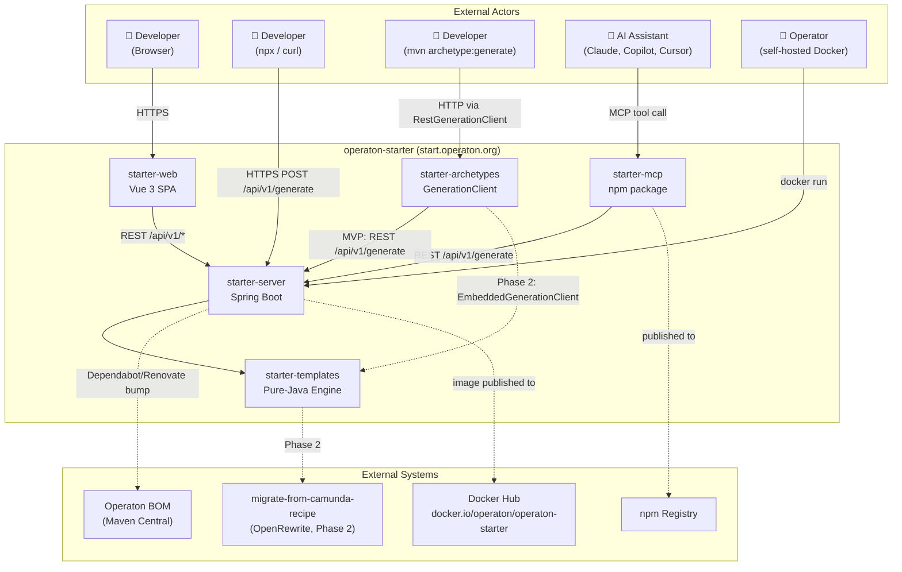
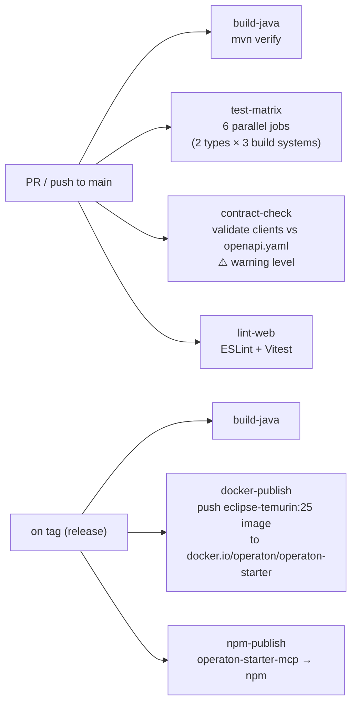
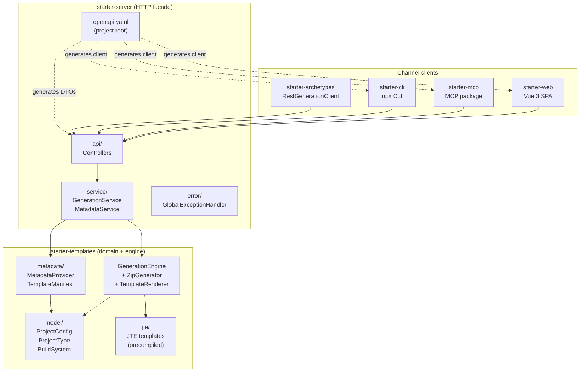

# Architecture Decision Document

_This document builds collaboratively through step-by-step discovery. Sections are appended as we work through each architectural decision together._

## Project Context Analysis
> arc42 Sections 1–3: Introduction & Goals, Constraints, System Scope

### Requirements Overview

**Functional Requirements (44 total):**

| Category | Count | Architectural Significance |
|----------|-------|---------------------------|
| Generation Engine | 9 (FR1–8, FR42) | Unified engine shared by all channels; CLI/MCP clients generated from OpenAPI spec |
| Project Configuration | 8 (FR9–16) | Identity propagation (Group/Artifact/name) is a correctness invariant across all generated files |
| Web UI | 10 (FR17–23, FR40–41, FR43) | SPA consuming metadata endpoint; client-side preview from template manifests; no per-change server round-trip |
| REST API | 4 (FR24–27) | Spec-first contract; rate limiting at IP level; metadata drives all channels |
| CLI | 3 (FR28–30) | Thin REST wrapper; dual-mode (scriptable pipe vs interactive terminal) |
| MCP Integration | 2 (FR31–32) | npm package client generated from OpenAPI spec; configurable base URL |
| Generated Project Quality | 6 (FR33–36, FR44) | CI matrix validates all project type × build system combinations |
| Self-Hosting & Operations | 3 (FR37–39) | Docker image; env-var configuration only; health endpoint |

**Non-Functional Requirements:**

| Category | Key Constraints | Architectural Impact |
|----------|----------------|---------------------|
| Performance | POST /api/v1/generate ≤ 1s; preview ≤ 200ms (client-side) | Pure-Java in-process engine; no Maven subprocess at runtime |
| Availability | 99.9% uptime; zero external deps at startup | Stateless design; no DB dependency |
| Security | HTTPS; no user data persistence; rate limit (10 req/min/IP) | Bucket4j in-memory, best-effort; no Redis; zero PII |
| Scalability | Horizontally scalable; no sticky sessions | Share-nothing; stateless request handling |
| Accessibility | WCAG 2.1 AA; keyboard-complete flow | Web UI component design must support full keyboard navigation |
| Correctness | 100% compile + test pass; CI matrix all combinations | Engine testable without Spring context; plain Java library |
| Compatibility | Java 21+; Gradle 8+; Node.js Active LTS; latest 2 browsers | Technology floor for generated projects and runtime |
| Maintainability | Structured JSON logs; env-var-only Docker config | Operational simplicity by design |
| Visual Consistency | Match operaton.org design system (NFR20) | Extract CSS tokens from Jekyll source; SPA consumes tokens |

**Scale & Complexity:**

- Primary domain: Full-stack monorepo (Java server/templates/archetypes + TypeScript web/MCP)
- Complexity level: Medium
- Estimated architectural components: 5 monorepo modules + deployment infrastructure
- Resource profile: Solo developer

### Technical Constraints & Dependencies

- **Operaton BOM:** Generated projects always target current stable Operaton release; starter updates within 24h via automated Dependabot/Renovate PR + CI matrix pass. SLA is conditional on CI matrix passing cleanly — a breaking Operaton release pauses the SLA clock until templates are fixed.
- **Generation engine performance:** `mvn archetype:generate` (Maven subprocess) MUST NOT be used at runtime — Maven startup overhead violates NFR1 ≤1s. Maven Archetype format is the template authoring standard only; runtime engine is a pure-Java in-process library.
- **OpenAPI Generator:** CLI and MCP client code generated from the spec; spec must be frozen before client generation begins; any post-freeze change requires regenerating all clients.
- **GenerationClient strategy interface:** `starter-archetypes` defines a `GenerationClient` interface. MVP: `RestGenerationClient` (HTTP call to `/api/v1/generate`). Phase 2+: `EmbeddedGenerationClient` (calls `starter-templates` directly, no network). Enables offline `mvn archetype:generate` without engine duplication.
- **`starter-templates` zero Spring dependency:** Pure-Java library; no Spring context in generation path; enables fast CI matrix and direct embedding.
- **Rate limiting:** Bucket4j in-memory, best-effort per IP; no Redis; stateless constraint preserved.
- **Design system:** operaton.org is Jekyll-based (`github.com/operaton/operaton.org`); CSS design tokens (colors, typography, spacing) extracted before `starter-web` implementation begins.
- **SPA framework:** Vue 3 + Vite (no framework constraint from existing Jekyll site).
- **Docker registry:** `docker.io/operaton/operaton-starter`; published on every tagged release via CI.
- **Spec freeze gate:** GitHub Actions check posting to PR status panel (warning level, not merge block); promotes to hard block in Phase 2 once spec is stable.
- **Multi-language build:** Maven coordinates Java modules; npm coordinates TypeScript modules; CI orchestrates both.
- **OpenRewrite (`operaton/migrate-from-camunda-recipe`):** Phase 2 dependency; tracked explicitly; fork under Operaton org if upstream lapses.
- **Docker:** Self-hosted image starts with zero external network calls; env-var configuration only.

### Metadata Schema as First-Class Contract

`GET /api/v1/metadata` is the **projection contract** between the engine and all consumers (web UI, CLI, MCP, future channels). Schema must be defined before any channel implementation begins. Each `projectTypes` entry contains:

| Field | Purpose |
|-------|---------|
| `id` | Flag value for CLI, tool parameter for MCP |
| `displayName` | Rendered in gallery cards and dropdowns |
| `description` | Gallery card body copy |
| `tags` | Capability badges |
| `personaHint` | Contextual positioning (e.g. "Ideal for Camunda 7 migrators") |
| `templateManifest` | Flat list of `{ path, condition, templateId }` enabling client-side file tree preview |

No hardcoded option lists in any channel. Gallery content (including `personaHint`) is metadata-driven from day one.

### System Context Diagram

> arc42 Section 3 — full diagram in `./docs/arc42/03-context.md`



### Cross-Cutting Concerns Identified

1. **Channel consistency** — Web UI, REST API, CLI, MCP, and `mvn archetype:generate` invoke the same generation engine; functionally identical output enforced by CI matrix
2. **Spec-first discipline** — OpenAPI spec and metadata schema frozen before any channel implementation; spec freeze enforced as a GitHub Actions PR status check (warning level)
3. **Stateless design** — No session state, no database, no sticky sessions; Bucket4j in-memory rate limiting (best-effort)
4. **Identity propagation** — Group ID, Artifact ID, project name flow into BPMN process IDs, Java package names, `application.name`, build coordinates
5. **Version currency** — Always current Operaton release; automated via Dependabot/Renovate PR + CI matrix gate; ≤24h SLA conditional on CI matrix pass
6. **Client-side preview** — Metadata template manifest schema drives file tree rendering without server round-trips; schema is an architectural artifact, not an implementation detail
7. **Observability** — Structured JSON logs; `/actuator/health` for load balancer integration
8. **Security** — HTTPS enforced; transient IP rate limiting; zero PII persistence
9. **Implementation sequence** — OpenAPI spec → metadata schema → generate clients → engine → channels (web UI and MCP parallel once API is solid; CLI last)

## Starter Template Evaluation
> arc42 Section 4 (partial): Technology Decisions & Bootstrapping Strategy

### Primary Technology Domain

Multi-module monorepo: Java backend (Spring Boot) + TypeScript SPA (Vue 3) + TypeScript npm package (MCP). No single starter covers the full project — each module bootstrapped from its canonical generator.

### Versions (current as of 2026-03-27)

| Component | Version |
|-----------|---------|
| Operaton BOM | 2.0.0 |
| Spring Boot | 4.0.4 |
| Java target | 21 (LTS) |
| Vue | 3.5.31 |
| create-vue (scaffolding) | 3.19.0 |
| @modelcontextprotocol/sdk | 1.28.0 |

### Module Bootstrapping Strategy

#### `starter-server` — Spring Boot Application

**Generator:** Spring Initializr (`start.spring.io`)

```bash
curl https://start.spring.io/starter.zip \
  -d type=maven-project \
  -d language=java \
  -d bootVersion=4.0.4 \
  -d javaVersion=21 \
  -d groupId=org.operaton.dev \
  -d artifactId=starter-server \
  -d dependencies=web,actuator,validation \
  -o starter-server.zip
```

**Architectural decisions provided:**
- Spring Boot 4.0.4 + Jakarta EE 11 baseline
- Maven build with Spring Boot parent POM
- `spring-boot-starter-web` (REST layer), `spring-boot-starter-actuator` (health endpoint)
- Operaton BOM 2.0.0 added manually as imported BOM after generation

#### `starter-templates` — Pure Java Generation Engine

**Generator:** None — plain Maven module added to parent POM.

**Architectural decisions:**
- Zero Spring dependencies (enforced via `maven-enforcer-plugin` or ArchUnit test)
- **JTE** (Java Template Engine) as template engine — precompiled at build time via `jte-maven-plugin`; zero runtime template parsing; template classes shipped in JAR
- Single public API: `GenerationEngine.generate(ProjectConfig) → byte[]`

#### `starter-archetypes` — GenerationClient Interface + MVP Wrapper

**Generator:** None — plain Maven module.

**Architectural decisions:**
- Defines `GenerationClient` interface
- MVP: `RestGenerationClient` (Java 11 `HttpClient`)
- Phase 2+: `EmbeddedGenerationClient` (direct call to `starter-templates`, no network)

#### `starter-web` — Vue 3 SPA

**Generator:** `npm create vue@latest`

```bash
npm create vue@latest starter-web
# Selections: TypeScript ✓, Vue Router ✓, Vitest ✓, ESLint+Prettier ✓
# Pinia: ✗ (form state is local; no global state manager needed)
```

**Architectural decisions provided:**
- Vue 3.5.31 + Vite build tooling
- TypeScript throughout
- Vue Router (gallery ↔ form navigation)
- Vitest for unit tests
- ESLint + Prettier

#### `starter-mcp` — MCP npm Package

**Generator:** `npm init` + manual TypeScript setup

```bash
mkdir starter-mcp && cd starter-mcp && npm init -y
npm install @modelcontextprotocol/sdk@1.28.0
npm install -D typescript @types/node ts-node
```

**Architectural decisions:**
- `@modelcontextprotocol/sdk` 1.28.0
- Client code generated from OpenAPI spec (spec-first discipline)
- Published as `operaton-starter-mcp` on npm
- `main` field points to compiled JS; `types` field to `.d.ts`

### Monorepo Build Coordination

```
operaton-starter/          ← Maven parent POM (multi-module)
├── pom.xml                ← parent; aggregates all modules
├── starter-server/        ← Spring Boot (Maven module)
├── starter-templates/     ← Pure Java library (Maven module)
├── starter-archetypes/    ← GenerationClient (Maven module)
├── starter-web/           ← Vue 3 SPA (Maven module via frontend-maven-plugin)
└── starter-mcp/           ← MCP npm package (Maven module via frontend-maven-plugin)
```

`starter-web` and `starter-mcp` are Maven modules whose POMs use `com.github.eirslett:frontend-maven-plugin` to download a pinned Node.js/npm version and execute `npm ci && npm run build`. This ensures hermetic builds — no system Node.js dependency, identical Node version in CI and local builds.

```xml
<plugin>
  <groupId>com.github.eirslett</groupId>
  <artifactId>frontend-maven-plugin</artifactId>
  <configuration>
    <nodeVersion>v22.x.x</nodeVersion>
    <npmVersion>10.x.x</npmVersion>
  </configuration>
  <executions>
    <execution>
      <goals><goal>install-node-and-npm</goal></goals>
    </execution>
    <execution>
      <goals><goal>npm</goal></goals>
      <configuration><arguments>ci</arguments></configuration>
    </execution>
    <execution>
      <goals><goal>npm</goal></goals>
      <configuration><arguments>run build</arguments></configuration>
    </execution>
  </executions>
</plugin>
```

### Pre-publish Note

`org.operaton.dev` groupId must be claimed at `central.sonatype.com` before first Maven Central publish. Verify namespace ownership before the first release pipeline runs.

### Implementation Sequence (Confirmed)

1. Define OpenAPI spec + metadata schema (no code)
2. Bootstrap `starter-templates` — generation engine, testable standalone
3. Bootstrap `starter-server` — wire engine behind REST API, freeze spec
4. Generate CLI client stub for `starter-archetypes` from frozen spec
5. Bootstrap `starter-web` and `starter-mcp` in parallel
6. Bootstrap `starter-archetypes` (`RestGenerationClient` MVP) last

## Core Architectural Decisions
> arc42 Section 4: Solution Strategy & Technology Decisions

### Decision Priority Analysis

**Critical Decisions (block implementation):**
- Template engine: JTE (precompiled)
- OpenAPI spec serving: Scalar via static HTML + CDN
- CSS/Styling: Tailwind CSS with operaton.org design tokens
- Docker base image: `eclipse-temurin:25-jre-alpine`
- Generated project Java version: default 17, picker offers 17/21/25

**Important Decisions (shape architecture):**
- CI/CD pipeline structure: GitHub Actions with build + test-matrix + contract-check + lint jobs
- Metadata schema: top-level `globalOptions` for `javaVersions` and `buildSystems`
- JTE spike: required as first `starter-templates` implementation story

**Deferred Decisions (Post-MVP):**
- Scalar Spring Boot starter adoption (pending Spring Boot 4 compatibility confirmation — HTML+CDN preferred anyway)
- `EmbeddedGenerationClient` for offline `mvn archetype:generate` (Phase 2)
- Tailwind → CSS custom property export for non-Tailwind custom CSS (Phase 2 refinement)

### Data Architecture

- **No database** — stateless design; all request state is ephemeral and cleared after each response
- **Rate limiting** — Bucket4j in-memory, best-effort per IP (10 req/min); no external store; no sticky sessions required
- **No caching layer** — generation is fast enough (≤1s target with JTE precompiled templates); no cache invalidation complexity

### Authentication & Security

- **No authentication** — stateless by design; no user profiles, no sessions
- **HTTPS** — all traffic to `start.operaton.org` served over HTTPS; HTTP redirects to HTTPS (handled at load balancer / reverse proxy layer)
- **Rate limiting** — HTTP 429 + `Retry-After` header on breach; Bucket4j in-memory
- **No PII** — only transient IP-based data held for rate limit window; discarded after window expires
- **CORS** — configured to allow browser requests from `start.operaton.org` and `localhost` (dev); self-hosted instances configure via env var

### API & Communication Patterns

- **Spec-first** — `openapi.yaml` is the source of truth; server stubs and all clients generated via `openapi-generator-maven-plugin`; spec freeze is a GitHub Actions PR status check (warning level)
- **API versioning** — base path `/api/v1/`; versioned from day one
- **OpenAPI spec serving** — static `openapi.yaml` served from `src/main/resources/static/`; Scalar rendered via static HTML page at `/api/v1/docs` loading Scalar from CDN; zero Spring Boot version coupling
- **Error responses** — standard RFC 7807 Problem Details (`application/problem+json`) for all error responses
- **Rate limit response** — HTTP 429 with `Retry-After` header

**Metadata schema structure (top-level):**
```json
{
  "projectTypes": [
    {
      "id": "string",
      "displayName": "string",
      "description": "string",
      "tags": ["string"],
      "personaHint": "string",
      "templateManifest": [
        { "path": "string", "condition": "string|null", "templateId": "string" }
      ]
    }
  ],
  "buildSystems": [
    { "id": "string", "displayName": "string" }
  ],
  "globalOptions": {
    "javaVersions": {
      "options": [17, 21, 25],
      "default": 17
    }
  }
}
```

### Frontend Architecture

- **Framework** — Vue 3.5.x + Vite; TypeScript throughout
- **Routing** — Vue Router; two primary routes: gallery (`/`) and configuration form (`/configure`)
- **State management** — none (no Pinia); form state is local component state; URL query params for shareable config links
- **Styling** — Tailwind CSS with custom theme configuration mapping operaton.org design tokens (colors, typography, spacing extracted from `github.com/operaton/operaton.org` Jekyll source before implementation begins); Tailwind config also exports tokens as CSS custom properties for non-utility custom CSS
- **Preview rendering** — pure function of `metadata.projectTypes[selected].templateManifest` + current form state; no server round-trip; target ≤200ms update after any input change
- **Testing** — Vitest for unit tests; axe-core in CI for WCAG 2.1 AA accessibility validation
- **Build** — Vite; output served as static assets embedded in the Spring Boot JAR (`src/main/resources/static/`) or served separately

### Infrastructure & Deployment

- **Docker base image** — `eclipse-temurin:25-jre-alpine`; server runtime Java 25
- **Generated project Java** — default Java 17; picker offers 17 / 21 / 25; all three validated in CI matrix
- **Docker registry** — `docker.io/operaton/operaton-starter`; published on every tagged release
- **Environment configuration** — all runtime config via environment variables; no file-based config at runtime
- **Logging** — structured JSON via Logback + `logstash-logback-encoder`; compatible with standard log aggregators
- **Health** — `/actuator/health` (Spring Boot Actuator); minimal actuator exposure (health only, no metrics endpoint by default)

**CI/CD pipeline (GitHub Actions):**



**Pre-publish prerequisite:** `org.operaton.dev` groupId must be claimed at `central.sonatype.com` before first Maven Central publish.

### Decision Impact Analysis

**Implementation sequence (confirmed):**
1. Author `openapi.yaml` + metadata schema (no code)
2. Spike `starter-templates` with JTE precompilation — validate zero-Spring constraint
3. Implement generation engine in `starter-templates`
4. Wire engine into `starter-server` REST API; freeze spec
5. Extract operaton.org design tokens → `tailwind.config.js`
6. Implement `starter-web` and `starter-mcp` in parallel (both consume frozen spec)
7. Implement `starter-archetypes` `RestGenerationClient` (MVP) last

**Cross-component dependencies:**
- `starter-templates` has no dependencies on other modules — can be developed and tested in isolation
- `starter-server` depends on `starter-templates`; spec freeze gates all other channel work
- `starter-web` and `starter-mcp` both depend on frozen spec; parallel development is safe after freeze
- `starter-archetypes` depends on `starter-server` being deployed (REST target); developed last
- All JTE templates in `starter-templates` are inputs to the CI test matrix — any template change triggers full matrix run

## Implementation Patterns & Consistency Rules
> arc42 Section 6: Cross-cutting Concepts

### Critical Conflict Points (9 identified)

Agents working on different modules could independently make incompatible choices in: package naming, JSON field naming, API response shape, error handling, test placement, Vue component organization, generated code boundaries, logging format, and validation approach.

### Domain Model Ownership

**`starter-templates` owns the shared domain model.** All other modules import from it — no module defines its own parallel representation.

| Type | Location |
|------|----------|
| `ProjectConfig` | `org.operaton.dev.starter.templates.model` |
| `BuildSystem` (enum) | `org.operaton.dev.starter.templates.model` |
| `ProjectType` (enum) | `org.operaton.dev.starter.templates.model` |

**Rule:** `starter-server` request DTOs are generated from `openapi.yaml` and mapped to `ProjectConfig`. They are not the domain model.

### Naming Patterns

**Java packages — all modules use `org.operaton.dev.starter.*`:**

| Module | Root Package |
|--------|-------------|
| `starter-server` | `org.operaton.dev.starter.server` |
| `starter-templates` | `org.operaton.dev.starter.templates` |
| `starter-archetypes` | `org.operaton.dev.starter.archetypes` |

**Java code conventions:**
- Classes: `PascalCase`
- Methods / variables: `camelCase`
- Constants: `UPPER_SNAKE_CASE`
- Test classes: suffix `Test` → `GenerationEngineTest`
- No abbreviations in public API names: `generateProject`, not `genProj`

**API endpoint naming — plural resource nouns:**
- ✅ `POST /api/v1/generate`, `GET /api/v1/metadata`, `GET /api/v1/docs`
- ❌ `/api/v1/generateProject`, `/api/v1/getMetadata`

**JSON field naming — `camelCase` throughout (Jackson default):**
- ✅ `groupId`, `artifactId`, `projectName`, `buildSystem`, `javaVersion`
- ❌ `group_id`, `artifact_id`, `GroupId`

**TypeScript naming (`starter-web`, `starter-mcp`):**
- Vue components: `PascalCase` filename and name → `ProjectGallery.vue`
- Composables: `use` prefix → `useMetadata.ts`, `useProjectForm.ts`
- Types / interfaces: `PascalCase` → `ProjectConfig`, `MetadataResponse`
- Variables / functions: `camelCase`
- Generated API client files: live in `src/generated/` — **never hand-edited**

### Structure Patterns

**Java module layout (Maven standard — all Java modules):**
```
src/
├── main/java/org/operaton/dev/starter/{module}/
├── main/resources/
└── test/java/org/operaton/dev/starter/{module}/
```

**`starter-web` layout:**
```
src/
├── assets/          ← static assets, design token CSS
├── components/      ← organized by feature (not by type)
│   ├── gallery/
│   ├── form/
│   └── preview/
├── composables/     ← all useXxx.ts files
├── generated/       ← OpenAPI-generated API client (do not edit)
├── router/          ← Vue Router configuration
├── types/           ← TypeScript type definitions
└── views/           ← GalleryView.vue, ConfigureView.vue
```

**`starter-mcp` layout:**
```
src/
├── generated/       ← OpenAPI-generated client (do not edit)
├── tools/           ← MCP tool definitions
└── index.ts         ← package entry point
```

**Rule:** `src/generated/` in any module is owned by the OpenAPI generator. No human or agent edits these files. Spec changes require re-running the generator.

### Format Patterns

**API response format — direct responses, no wrapper:**
- ✅ `200 OK` with `ProjectConfig` body directly
- ❌ `{ "data": {...}, "status": "ok" }` wrapper — never

**Error response format — RFC 7807 Problem Details (`application/problem+json`):**
```json
{
  "type": "https://start.operaton.org/errors/rate-limit-exceeded",
  "title": "Rate Limit Exceeded",
  "status": 429,
  "detail": "10 requests per minute exceeded. Retry after 42 seconds.",
  "instance": "/api/v1/generate"
}
```

**HTTP status codes:**
| Situation | Status |
|-----------|--------|
| Successful generation | `200 OK` |
| Invalid request body | `400 Bad Request` |
| Rate limit exceeded | `429 Too Many Requests` |
| Server error | `500 Internal Server Error` |

**Date / time format:** ISO 8601 strings only — `"2026-03-27T14:00:00Z"`

### Process Patterns

**Error handling — Java (`starter-server`):**
- Domain exceptions thrown in service layer; single `@ControllerAdvice` translates all to Problem Details
- No try/catch in controllers
- `ERROR` log with full stack trace in `@ControllerAdvice`; client receives no stack trace

**Error handling — TypeScript (`starter-web`):**
- `useApiError` composable wraps all API calls; exposes `{ error: Ref<ProblemDetail | null> }`
- Errors displayed via shared `<ErrorBanner>` component — no inline error handling in individual components
- Network failures mapped to synthetic Problem Detail with `status: 0`

**Vue composable contract — all API composables expose the same shape:**
```typescript
const { data, isLoading, error } = useMetadata()
const { data, isLoading, error } = useGenerate()
// data: Ref<T | null>, isLoading: Ref<boolean>, error: Ref<ProblemDetail | null>
```

**Loading states — `starter-web`:**
- Per-operation `ref<boolean>`: `isLoadingMetadata`, `isGenerating`
- No global loading state; set `true` before fetch, `false` in `finally`

**Validation:**
- **Java:** Bean Validation (`@Valid`) on request DTOs; errors return `400` Problem Detail automatically
- **TypeScript:** Client-side form validation mirrors OpenAPI spec field constraints

**Logging — `starter-server`:**
- Structured JSON only (Logback + `logstash-logback-encoder`)
- Levels: `ERROR` exceptions, `WARN` rate limit hits, `INFO` generation requests (with `projectType`, `buildSystem`, `javaVersion`), `DEBUG` template rendering
- No IP address in log body — IP only in rate limiter, never logged

### Testing Patterns

**Generation output contract test (`starter-templates`):**

Every project type × build system combination has a `@ParameterizedTest` that:
1. Calls `GenerationEngine.generate(config)`
2. Extracts the ZIP in-memory
3. Asserts specific files exist at specific paths
4. Asserts identity propagation in each relevant file:
   - `groupId` / `artifactId` / `projectName` appear in `pom.xml` or `build.gradle`
   - Package path matches `groupId.artifactId` in all Java source files
   - BPMN process ID contains `artifactId`
   - `spring.application.name` in `application.properties` matches `projectName`

**Zero-Spring enforcement (`starter-templates`):**

ArchUnit test asserts no class in `org.operaton.dev.starter.templates` imports from `org.springframework.*`. Build fails immediately if a Spring dependency is accidentally introduced.

```java
@Test
void templateModuleHasNoSpringDependencies() {
    noClasses()
        .that().resideInAPackage("org.operaton.dev.starter.templates..")
        .should().dependOnClassesThat()
        .resideInAPackage("org.springframework..")
        .check(importedClasses);
}
```

### Enforcement Guidelines

**All agents MUST:**
- Use `org.operaton.dev.starter.*` package root for all Java code
- Use `camelCase` for all JSON fields — never `snake_case` in API responses
- Return Problem Details (`application/problem+json`) for all error responses
- Never edit files in any `src/generated/` directory
- Use `starter-templates` domain model types — never redefine `ProjectConfig`, `BuildSystem`, or `ProjectType`
- Expose `{ data, isLoading, error }` from all API composables in `starter-web`
- Amend `openapi.yaml` and regenerate — never manually add fields to generated DTOs
- Precompile JTE templates — never use dynamic mode in production code

**Anti-patterns (never):**
- ❌ Response wrapper `{ data: ..., error: ... }` — use direct responses + Problem Details
- ❌ Calling `mvn archetype:generate` or any Maven subprocess at runtime
- ❌ Adding Spring dependencies to `starter-templates`
- ❌ Hardcoding project types, build systems, or Java version options in any channel
- ❌ Hand-editing `src/generated/` files
- ❌ Exposing stack traces in API error responses
- ❌ Defining parallel domain model classes outside `starter-templates`

## Project Structure & Boundaries
> arc42 Sections 5 & 7: Building Block View & Deployment View

### Monorepo Structure — Complete Project Tree

```
operaton-starter/
├── pom.xml                          ← Maven parent POM (6 modules)
├── openapi.yaml                     ← API contract source of truth (referenced by all modules)
├── Dockerfile                       ← starter-server image (eclipse-temurin:25-jre-alpine)
├── docker-compose.dev.yml           ← local development environment
├── renovate.json                    ← automated Operaton/dependency version bumps
├── .editorconfig
├── .gitignore
├── README.md
│
├── .github/
│   └── workflows/
│       ├── ci.yml                   ← build-java + test-matrix + contract-check + lint-web
│       └── release.yml              ← docker-publish + npm-publish (on tag)
│
├── docs/
│   └── arc42/
│       ├── 01-introduction-and-goals.md
│       ├── 02-constraints.md
│       ├── 03-context.md            ← system context diagram (Mermaid)
│       ├── 04-solution-strategy.md
│       ├── 05-building-block-view.md
│       ├── 06-runtime-view.md
│       ├── 07-deployment-view.md
│       ├── 08-crosscutting-concepts.md
│       ├── 09-architecture-decisions.md  ← ADRs for each significant decision
│       ├── 10-quality-requirements.md
│       ├── 11-risks.md
│       └── 12-glossary.md
│
├── starter-templates/               ← Pure-Java generation engine (zero Spring)
│   ├── pom.xml
│   └── src/
│       ├── main/
│       │   ├── java/org/operaton/dev/starter/templates/
│       │   │   ├── GenerationEngine.java          ← public API: generate(ProjectConfig)→byte[]
│       │   │   ├── model/
│       │   │   │   ├── ProjectConfig.java          ← domain model owner
│       │   │   │   ├── ProjectType.java            ← enum: PROCESS_APPLICATION, PROCESS_ARCHIVE
│       │   │   │   └── BuildSystem.java            ← enum: MAVEN, GRADLE_GROOVY, GRADLE_KOTLIN
│       │   │   ├── engine/
│       │   │   │   ├── ZipGenerator.java
│       │   │   │   └── TemplateRenderer.java
│       │   │   └── metadata/
│       │   │       ├── MetadataProvider.java
│       │   │       ├── ProjectTypeDescriptor.java
│       │   │       └── TemplateManifest.java
│       │   └── jte/                               ← JTE template sources (precompiled at build)
│       │       ├── process-application/
│       │       │   ├── maven/
│       │       │   ├── gradle-groovy/
│       │       │   └── gradle-kotlin/
│       │       ├── process-archive/
│       │       │   ├── maven/
│       │       │   ├── gradle-groovy/
│       │       │   └── gradle-kotlin/
│       │       └── common/
│       │           ├── README.jte
│       │           ├── github-actions.jte
│       │           ├── docker-compose.jte
│       │           ├── renovate.jte
│       │           ├── dependabot.jte
│       │           └── skeleton.bpmn.jte
│       └── test/java/org/operaton/dev/starter/templates/
│           ├── GenerationEngineTest.java          ← @ParameterizedTest all 6 combinations
│           ├── ZeroSpringDependencyTest.java       ← ArchUnit: no org.springframework imports
│           └── fixtures/
│               └── TestProjectConfigs.java
│
├── starter-server/                  ← Spring Boot REST API
│   ├── pom.xml
│   └── src/
│       ├── main/
│       │   ├── java/org/operaton/dev/starter/server/
│       │   │   ├── StarterServerApplication.java
│       │   │   ├── api/
│       │   │   │   ├── GenerateController.java
│       │   │   │   ├── MetadataController.java
│       │   │   │   ├── DocsController.java        ← serves Scalar HTML page at /api/v1/docs
│       │   │   │   ├── dto/                       ← generated to target/generated-sources/ (do not edit)
│       │   │   │   └── error/
│       │   │   │       └── GlobalExceptionHandler.java  ← @ControllerAdvice → Problem Details
│       │   │   ├── config/
│       │   │   │   ├── RateLimitConfig.java        ← Bucket4j beans
│       │   │   │   └── WebConfig.java              ← CORS configuration
│       │   │   └── service/
│       │   │       ├── GenerationService.java
│       │   │       └── MetadataService.java
│       │   └── resources/
│       │       ├── application.properties
│       │       └── static/
│       │           ├── api-docs.html              ← Scalar CDN page
│       │           └── (starter-web dist/ copied here by starter-web build)
│       └── test/java/org/operaton/dev/starter/server/
│           ├── api/
│           │   ├── GenerateControllerTest.java
│           │   └── MetadataControllerTest.java
│           └── integration/
│               └── GenerationIntegrationTest.java
│
├── starter-archetypes/              ← GenerationClient interface + RestGenerationClient
│   ├── pom.xml
│   └── src/
│       ├── main/
│       │   ├── java/org/operaton/dev/starter/archetypes/
│       │   │   ├── GenerationClient.java           ← interface
│       │   │   ├── RestGenerationClient.java        ← MVP: calls /api/v1/generate
│       │   │   └── config/
│       │   │       └── ClientConfig.java
│       │   └── resources/META-INF/maven/
│       │       └── archetype-metadata.xml
│       └── test/java/org/operaton/dev/starter/archetypes/
│           └── RestGenerationClientTest.java
│
├── starter-web/                     ← Vue 3 SPA
│   ├── pom.xml                      ← frontend-maven-plugin; copies dist/ → starter-server/src/main/resources/static/
│   ├── package.json
│   ├── vite.config.ts
│   ├── tailwind.config.js           ← operaton.org design tokens mapped here
│   ├── tsconfig.json
│   └── src/
│       ├── main.ts
│       ├── App.vue
│       ├── assets/
│       │   ├── tokens.css           ← CSS custom properties from operaton.org Jekyll source
│       │   └── base.css
│       ├── components/
│       │   ├── gallery/
│       │   │   ├── ProjectGallery.vue
│       │   │   ├── ProjectCard.vue
│       │   │   └── TypeBadge.vue
│       │   ├── form/
│       │   │   ├── ConfigurationForm.vue
│       │   │   ├── BuildSystemSelector.vue
│       │   │   ├── JavaVersionSelector.vue
│       │   │   ├── IdentityFields.vue
│       │   │   └── OptionalExtras.vue
│       │   ├── preview/
│       │   │   ├── FileTreePreview.vue
│       │   │   └── FileTreeNode.vue
│       │   └── shared/
│       │       ├── ErrorBanner.vue
│       │       └── LoadingSpinner.vue
│       ├── composables/
│       │   ├── useMetadata.ts
│       │   ├── useGenerate.ts
│       │   └── useShareableLink.ts
│       ├── generated/               ← OpenAPI-generated API client (do not edit)
│       ├── router/
│       │   └── index.ts
│       ├── types/
│       │   └── api.ts
│       └── views/
│           ├── GalleryView.vue
│           └── ConfigureView.vue
│
├── starter-mcp/                     ← operaton-starter-mcp npm package
│   ├── pom.xml                      ← frontend-maven-plugin wrapper
│   ├── package.json                 ← name: "operaton-starter-mcp"
│   ├── tsconfig.json
│   └── src/
│       ├── index.ts
│       ├── tools/
│       │   └── generateProject.ts
│       └── generated/               ← OpenAPI-generated client (do not edit)
│
└── starter-cli/                     ← operaton-starter npm CLI package
    ├── pom.xml                      ← frontend-maven-plugin wrapper
    ├── package.json                 ← name: "operaton-starter", bin: "operaton-starter"
    ├── tsconfig.json
    └── src/
        ├── index.ts                 ← dual-mode: pipe → raw bytes / TTY → interactive prompts
        ├── commands/
        │   └── generate.ts
        └── generated/               ← OpenAPI-generated client (do not edit)
```

### Key Build Notes

- `openapi.yaml` lives at project root; all `openapi-generator` invocations reference `../../openapi.yaml`
- Generated DTOs/clients output to `target/generated-sources/openapi/` — never to `src/`; gitignored automatically
- `starter-web` Maven build: `frontend-maven-plugin` runs `npm ci && npm run build`, then `maven-resources-plugin` copies `dist/` to `starter-server/src/main/resources/static/`
- `docker-compose.dev.yml` at root is for local development only — distinct from `docker-compose.yml` generated inside project archives

### Architectural Boundaries



### Requirements to Structure Mapping

| FR Category | Primary Location |
|-------------|-----------------|
| Generation Engine (FR1–8, FR42) | `starter-templates/` — `GenerationEngine`, JTE templates |
| Project Configuration (FR9–16) | `starter-templates/model/` — `ProjectConfig`, enums |
| Web UI (FR17–23, FR40–41, FR43) | `starter-web/src/` — views, components, composables |
| REST API (FR24–27) | `starter-server/src/main/`, `openapi.yaml` at root |
| CLI (FR28–30) | `starter-cli/src/` — dual-mode entry point |
| MCP Integration (FR31–32) | `starter-mcp/src/tools/generateProject.ts` |
| Generated Project Quality (FR33–36, FR44) | `starter-templates/jte/` — all JTE template files |
| Self-Hosting & Operations (FR37–39) | `Dockerfile`, `application.properties`, `WebConfig.java` |

### Integration Points & Data Flow

**Generation request flow:**
```
Client → POST /api/v1/generate
  → GenerateController (validates DTO from target/generated-sources/)
  → GenerationService (maps DTO → ProjectConfig)
  → GenerationEngine.generate(ProjectConfig)
  → ZipGenerator (iterates TemplateManifest)
  → TemplateRenderer (JTE precompiled classes)
  → byte[] ZIP → 200 OK
```

**Metadata + client-side preview flow:**
```
Client → GET /api/v1/metadata
  → MetadataController → MetadataService → MetadataProvider
  → MetadataResponse JSON (includes templateManifest per projectType)
  → Vue FileTreePreview: pure function of templateManifest + formState
  → no further server calls for preview updates
```

**Build-time spec propagation:**
```
openapi.yaml (project root)
  → starter-server: openapi-generator-maven-plugin → target/generated-sources/openapi/dto/
  → starter-web:    openapi-generator (npm) → src/generated/
  → starter-mcp:    openapi-generator (npm) → src/generated/
  → starter-cli:    openapi-generator (npm) → src/generated/
```

## Architecture Validation Results
> arc42 Section 11 (partial): Risks & Technical Debt

### Coherence Validation ✅

All technology choices are mutually compatible. Spring Boot 4.0.4 (Jakarta EE 11) is confirmed compatible with Operaton BOM 2.0.0. JTE operates as a pure-Java library with no framework dependency. Vue 3 + Vite + Tailwind is a well-established combination. Scalar served via static HTML eliminates Spring Boot version coupling risk entirely.

**Configuration note:** `openapi-generator-maven-plugin` must set `useSpringBoot3=true` in the Spring generator configuration to produce Spring Framework 6/7-compatible server stubs.

### Requirements Coverage ✅

All 44 functional requirements and 20 non-functional requirements have architectural support. See Requirements to Structure Mapping in Project Structure section.

**NFR13 correction:** Generated project Java floor is **17** (not 21 as stated in PRD); picker offers 17/21/25; default is 17.

### Gap Analysis — All Resolved

| Gap | Resolution |
|-----|-----------|
| FR16 — Shareable config links encoding | Individual URL query params (`?type=...&build=...&groupId=...`). Human-readable, debuggable, no decoder needed. `useShareableLink.ts` serializes/deserializes form state. Round-trip unit test required. |
| FR32 — MCP configurable base URL | Env var `OPERATON_STARTER_BASE_URL`; default `https://start.operaton.org` |
| openapi-generator Spring Boot 4 | `<useSpringBoot3>true</useSpringBoot3>` in `starter-server` POM |

### Additional Testing Pattern — Shareable Links

`useShareableLink.ts` must have a round-trip unit test:
serialize form state → query string → parse back → assert equals original.
Required for every new config field added; prevents silent breakage of shareable links.

### Architecture Decision Records (ADRs)

`docs/arc42/09-architecture-decisions.md` will contain individual ADRs for:

1. Unified generation engine — no per-channel logic
2. Maven Archetype format as authoring standard, not runtime execution
3. JTE as template engine (precompiled, zero runtime parsing)
4. Spec-first OpenAPI discipline with `openapi-generator`
5. Scalar API docs via static HTML + CDN (no Spring Boot coupling)
6. Stateless design — no database, no sessions
7. `GenerationClient` strategy interface (MVP: REST → Phase 2: embedded)
8. Metadata schema as first-class contract (not a convenience endpoint)
9. Individual URL query params for shareable config links
10. Best-effort in-memory rate limiting (Bucket4j, no Redis)

Each ADR: **Context** / **Decision** / **Consequences** format. Authored by Paige (tech writer) at documentation handoff.

### Architecture Completeness Checklist

**✅ Requirements Analysis**
- [x] 44 FRs analyzed and mapped to components
- [x] 20 NFRs addressed architecturally
- [x] Scale (medium), domain (full-stack monorepo), resource profile (solo dev) assessed
- [x] 9 cross-cutting concerns identified and documented

**✅ Architectural Decisions**
- [x] Template engine: JTE precompiled, zero runtime parsing
- [x] API spec: `openapi.yaml` at root, spec-first, `openapi-generator` for all clients
- [x] OpenAPI docs: Scalar via static HTML + CDN
- [x] CSS: Tailwind + operaton.org design tokens
- [x] CI/CD: GitHub Actions, 6-combination test matrix, contract-check warning
- [x] Docker: `eclipse-temurin:25-jre-alpine`; `docker.io/operaton/operaton-starter`
- [x] Generated project Java: default 17, picker 17/21/25
- [x] Rate limiting: Bucket4j in-memory, best-effort
- [x] 6-module monorepo confirmed (`starter-cli` as 6th module)

**✅ Implementation Patterns**
- [x] Package naming: `org.operaton.dev.starter.*`
- [x] JSON: camelCase throughout, RFC 7807 Problem Details for errors
- [x] Vue composables: `{ data, isLoading, error }` contract
- [x] Domain model ownership: `starter-templates`
- [x] Generated code boundary: `src/generated/` immutable
- [x] ArchUnit zero-Spring enforcement in `starter-templates`
- [x] Generation output contract tests (parameterized, all 6 combinations + identity propagation)
- [x] Shareable link round-trip unit test

**✅ Project Structure**
- [x] Complete 6-module monorepo tree defined
- [x] `openapi.yaml` at project root
- [x] Generated sources to `target/` (never `src/`)
- [x] `starter-web` dist copied to `starter-server/src/main/resources/static/`
- [x] `docker-compose.dev.yml` (distinct from generated project archives)
- [x] `docs/arc42/` structure defined (12 sections + 10 ADRs)
- [x] All FRs mapped to specific modules and files

### Architecture Readiness Assessment

**Overall Status: READY FOR IMPLEMENTATION**

**Confidence Level: High**

**Key Strengths:**
- Stateless-first design eliminates entire classes of operational complexity
- Spec-first discipline with generated clients prevents API drift by construction
- JTE precompilation + ArchUnit enforcement automate architectural constraint checking
- Unified generation engine with thin channel wrappers maximises reuse and correctness
- Metadata schema as first-class contract keeps all channels passively in sync

**Areas for Future Enhancement:**
- Phase 2: `EmbeddedGenerationClient` for offline `mvn archetype:generate`
- Phase 2: Promote contract-check from warning to hard merge block
- Phase 2: Camunda 7 Migration project type + OpenRewrite integration
- Post-MVP: Evaluate Scalar Spring Boot starter once Spring Boot 4 support confirmed

### Implementation Handoff

**First implementation story:** Spike `starter-templates` with JTE precompilation — validate zero-Spring constraint with ArchUnit test passing.

**Second story:** Author `openapi.yaml` at project root + metadata schema — spec freeze gates all subsequent channel work.

**AI Agent Guidelines:**
- This document is the authoritative source for all architectural decisions
- Refer to Patterns section before writing any code
- Never modify `src/generated/` — amend `openapi.yaml` and regenerate
- Run `ZeroSpringDependencyTest` after any change to `starter-templates`
- Any new project type requires a new `@ParameterizedTest` entry in `GenerationEngineTest`
- Any new config field requires updating `useShareableLink.ts` and its round-trip test